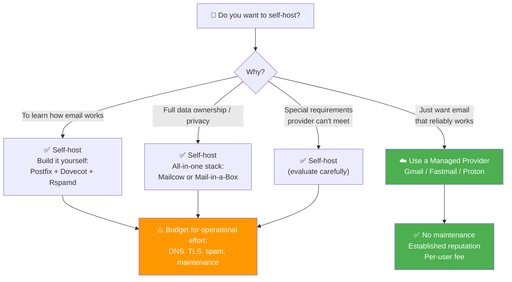
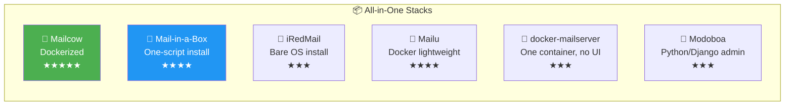
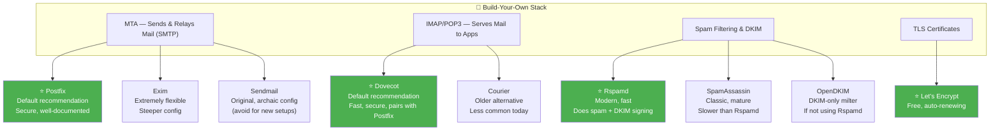
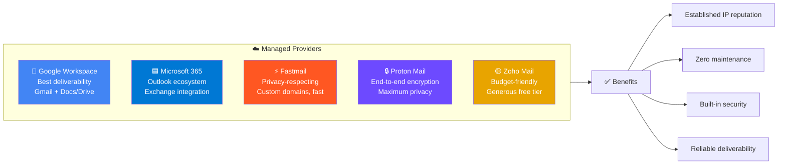
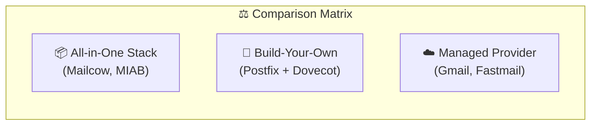
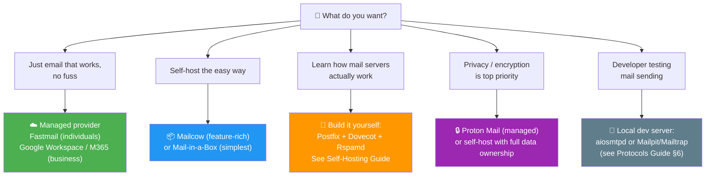

# Choosing Mail Server Software — Which One Is Best?

**Short answer: there is no single "best" mail server.** The right choice depends
entirely on your goal. This guide gives a clear recommendation for each common scenario,
then explains the options behind each one.

---

## Table of Contents

1. [First: Should You Self-Host at All?](#first-should-you-self-host-at-all)
2. [All-in-One Self-Hosted Stacks](#all-in-one-self-hosted-stacks)
3. [Build-Your-Own: Individual Components](#build-your-own-individual-components)
4. [Managed Providers (Don't Self-Host)](#managed-providers-dont-self-host)
5. [Comparison at a Glance](#comparison-at-a-glance)
6. [Recommendations: "If You Want X, Use Y"](#recommendations-if-you-want-x-use-y)

---

## First: Should You Self-Host at All?

Before picking software, answer this honestly:



Once you've decided to self-host, the next fork is:

```
All-in-one stack  →  §2 (easier, faster)
       vs.
Build your own    →  §3 (maximum control + learning)
```

---

## All-in-One Self-Hosted Stacks

These bundle Postfix + Dovecot + spam filtering + DKIM + a web admin (and often webmail)
into one installable package.



| Stack | What It Is | Best For | Watch Out For |
|-------|-----------|----------|---------------|
| **Mailcow** | Docker-based, modern web UI, very popular | Self-hosters wanting polished, full-featured server | Needs Docker; wants decent RAM |
| **Mail-in-a-Box** | Opinionated, one-script install on a clean box | Beginners wanting "just works" with minimal choices | Less flexible by design; takes over the box |
| **iRedMail** | Mature, runs on bare OS, free + paid admin panel | Traditional VM installs, multiple distros | Admin UI is basic in the free tier |
| **Mailu** | Docker-based, lightweight, config-file driven | Container fans wanting something lean | Fewer features than Mailcow |
| **docker-mailserver** | Just the mail stack in one container, no UI | Users comfortable with config files | No admin web UI |
| **Modoboa** | Python/Django admin + mail stack | Those wanting a clean management UI | Smaller community |

> **The usual picks:** **Mailcow** (most popular, feature-rich) or **Mail-in-a-Box** (simplest).

---

## Build-Your-Own: Individual Components

Maximum control and the best way to *understand* the system.
You pick one from each layer:



### The Canonical Stack

> **RECOMMENDED SELF-HOSTED STACK**
> 
> **Postfix + Dovecot + Rspamd + Let's Encrypt**
> 
> It's what all-in-one bundles assemble for you, and what the Self-Hosting Guide builds by hand.

---

## Managed Providers (Don't Self-Host)

If your goal is *email that reliably works* rather than *running a mail server*,
a managed provider is almost always the right answer.



| Provider | Best For |
|----------|----------|
| **Google Workspace** | Businesses wanting Gmail + Docs/Drive; excellent deliverability |
| **Microsoft 365** | Organizations in the Microsoft/Outlook ecosystem |
| **Fastmail** | Privacy-respecting, fast; great for individuals & small teams; custom domains |
| **Proton Mail** | End-to-end encryption / maximum privacy focus |
| **Zoho Mail** | Budget-friendly business mail, generous free tier |

---

## Comparison at a Glance



|   | All-in-One Stack | Build-Your-Own | Managed Provider |
|---|---|---|---|
| Control/Privacy | Full | Full | Provider holds data |
| Setup difficulty | Medium | High | Minimal |
| Maintenance | On you | On you | Handled |
| Deliverability | You build rep. | You build rep. | Established |
| Cost | Server + time | Server + more time | Per-user fee |
| Best for | Self-host without<br>hand-wiring | Learning / total<br>control | Just want it to work |
| Examples | Mailcow, MIAB | Postfix + Dovecot | Workspace, Fastmail |

---

## Recommendations: "If You Want X, Use Y"



> **Bottom line:** "best" = the option that matches your goal.
> Most people should use a managed provider.
> Self-hosters should reach for an all-in-one stack like Mailcow unless learning the
> internals is the point — in which case build from Postfix + Dovecot + Rspamd.

---

### See Also

- [← Troubleshooting & Ops](TROUBLESHOOTING.md) · [Self-Hosting Guide](SELF_HOSTING.md) · [Overview](OVERVIEW.md)

[← Back to index](../../README.md)
