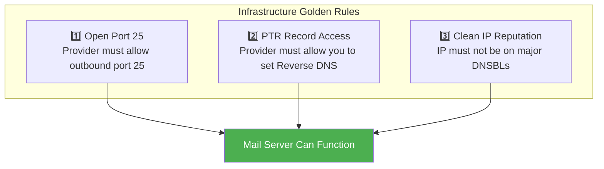
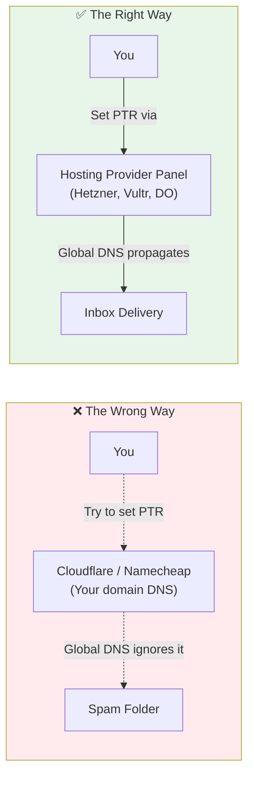
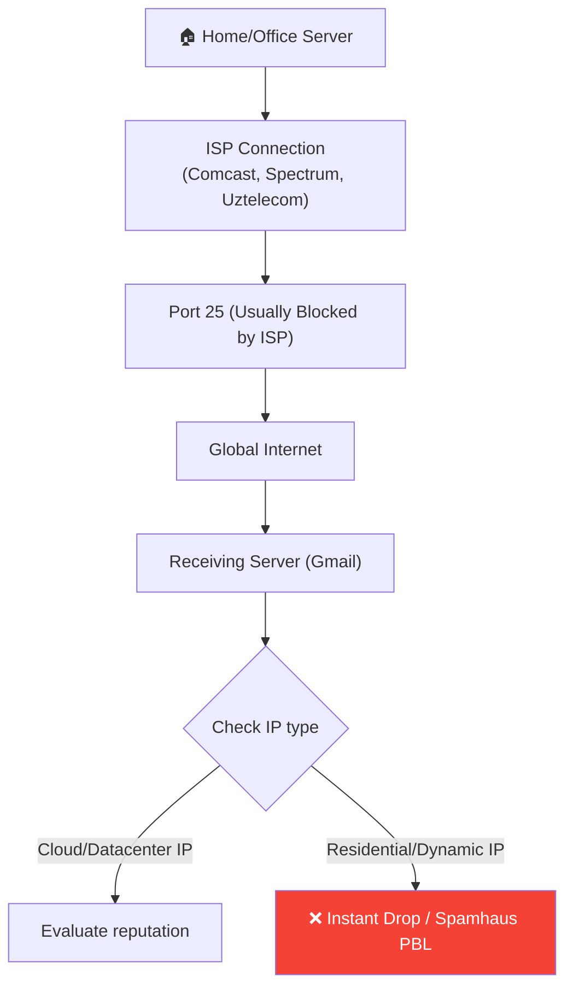

# Cloud Providers & Infrastructure for Mail Servers

> **Crucial Reality:** You can have the most perfectly configured mail server in the world,
> but if your underlying infrastructure (IP address, port 25, PTR record) is flawed,
> your emails will bounce or go straight to spam.

This guide explains how to choose the right infrastructure provider, how PTR records actually work,
and why you cannot host a reliable mail server on your home connection.

---

## Table of Contents

1. [The Three Golden Rules of Mail Infrastructure](#the-three-golden-rules-of-mail-infrastructure)
2. [Why You Can't Set PTR on Your Own Server](#why-you-cant-set-ptr-on-your-own-server)
3. [Cloud Provider Comparison](#cloud-provider-comparison)
4. [The Port 25 Problem](#the-port-25-problem)
5. [Why Residential IPs Fail](#why-residential-ips-fail)

---

## The Three Golden Rules of Mail Infrastructure

Before you install any software like Mailcow or Postfix, your infrastructure must pass these three tests:



If your chosen cloud provider fails *even one* of these rules, your mail server project will fail.

---

## Why You Can't Set PTR on Your Own Server

A common misconception is that you can configure PTR (Reverse DNS) in your Cloudflare dashboard or on your own BIND9 server. **You cannot.**



### The Mechanism

1. **A Record (Forward DNS):** Domain → IP. You control this because you *bought the domain*.
2. **PTR Record (Reverse DNS):** IP → Domain. The entity that *owns the IP block* controls this.

Because your hosting provider (or ISP) owns the IP address, the global DNS root servers delegate reverse lookups to them, not to you. Therefore, you **must** use your hosting provider's control panel to set the PTR record. 

---

## Cloud Provider Comparison

Not all cloud providers are friendly to self-hosted email. Many strictly block email traffic to combat spam. Here is a breakdown of the best and worst choices for hosting a mail server.

| Provider | PTR Support | Port 25 Status | Verdict | Notes |
|----------|-------------|----------------|---------|-------|
| **Hetzner** | ✅ 1-click in panel | ⚠️ Blocked by default | ⭐⭐⭐⭐⭐ | Unblocks quickly if you pay your first invoice and open a support ticket. Excellent pricing. |
| **Vultr** | ✅ Easy via panel | ⚠️ Blocked by default | ⭐⭐⭐⭐⭐ | Just open a ticket explaining you are setting up a mail server. Very fast unblock. |
| **DigitalOcean** | ✅ Uses Droplet name | ⚠️ Blocked for new users | ⭐⭐⭐⭐ | PTR is automatically set to your Droplet's hostname. Port 25 unblocks vary by account age. |
| **Linode / Akamai** | ✅ Supported in panel | ⚠️ Blocked by default | ⭐⭐⭐⭐ | Great reputation. Open a ticket to unblock Port 25. |
| **Contabo** | ✅ Supported in panel | ✅ Often open | ⭐⭐⭐ | Very cheap, but IP ranges are frequently blacklisted. Always check IP health immediately after purchase. |
| **AWS (EC2)** | ⚠️ Hard (Requires Elastic IP) | ❌ Strictly blocked | ⭐ | Requires form submissions, EIPs, and strict use cases. Not recommended for simple mail servers. |
| **Google Cloud (GCP)**| ⚠️ Hard | ❌ Strictly blocked | ⭐ | Port 25 is permanently blocked to external IPs on standard instances. |
| **Microsoft Azure** | ⚠️ Hard | ❌ Strictly blocked | ⭐ | Enterprise-focused; hostile to individual mail hosters. |

> **Recommendation:** Use **Hetzner** or **Vultr**. They provide the easiest PTR management and have reasonable policies for opening Port 25 for legitimate users.

---

## The Port 25 Problem

Port 25 is the standard port for Server-to-Server SMTP communication. 
When your mail server tries to send an email to `user@gmail.com`, it connects to Gmail's server on **Port 25**.

If your cloud provider blocks *outbound* Port 25, your server simply cannot transmit the email. It will sit in your mail queue forever.

**How to check if Port 25 is open:**
Run this command on your server (not your local computer):
```bash
nc -zv gmail-smtp-in.l.google.com 25
```

* **Success:** `Connection to gmail-smtp-in.l.google.com 25 port [tcp/smtp] succeeded!`
* **Blocked:** `nc: connect to gmail-smtp-in.l.google.com port 25 (tcp) failed: Connection timed out`

If it times out, you must contact your provider's support team.

---

## Why Residential IPs Fail

You might consider running a mail server on a Raspberry Pi or a spare PC in your house. **Do not do this.**



1. **PBL (Policy Block List):** Major anti-spam organizations like Spamhaus automatically list all residential and dynamic IP ranges on the PBL.
2. **Instant Rejection:** Most receiving mail servers are configured to instantly reject any mail coming from a residential IP range, regardless of how perfect your SPF/DKIM/DMARC records are.
3. **No PTR Access:** Your home ISP will almost never allow you to set a custom PTR record for a residential IP address.

**Conclusion:** A datacenter VPS with a static IP is absolutely mandatory.

---

### See Also

- [← Choosing Mail Server Software](CHOOSING_SOFTWARE.md)
- [← Troubleshooting & Operations](TROUBLESHOOTING.md)
- [Overview](OVERVIEW.md)

[← Back to index](../../README.md)
