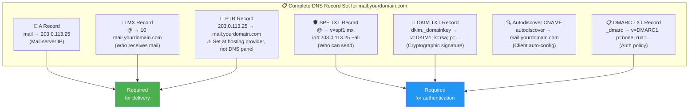
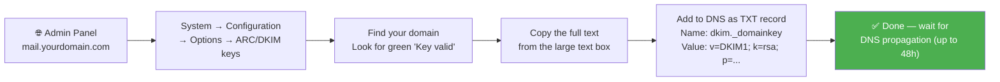
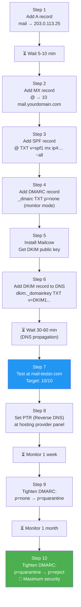
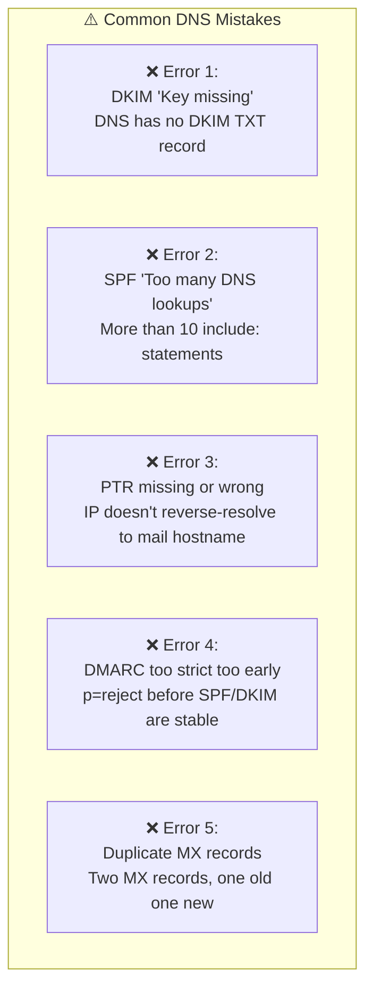

# DNS Quick Reference for Mail Servers

A complete, practical reference for every DNS record a mail server needs.
Includes record explanations, example values, verification commands, and common mistakes.

---

## Table of Contents

1. [All Required DNS Records](#all-required-dns-records)
2. [Getting Your DKIM Key](#getting-your-dkim-key)
3. [Step-by-Step Setup Order](#step-by-step-setup-order)
4. [Verification Commands](#verification-commands)
5. [Online Checking Tools](#online-checking-tools)
6. [Common DNS Mistakes](#common-dns-mistakes)

---

## All Required DNS Records



### Full Record Table

| Name | Type | TTL | Value | Purpose |
|------|------|-----|-------|---------|
| `@` | A | 14400 | `203.0.113.25` | Main domain → IP |
| `mail` | A | 14400 | `203.0.113.25` | Mail server hostname → IP |
| `autodiscover` | CNAME | 14400 | `mail.yourdomain.com` | Email client auto-config |
| `autoconfig` | CNAME | 14400 | `mail.yourdomain.com` | Email client auto-config |
| `@` | MX | 14400 | `10 mail.yourdomain.com` | Mail server for domain |
| `@` | TXT | 14400 | `v=spf1 mx ip4:203.0.113.25 ~all` | SPF — who can send |
| `_dmarc` | TXT | 14400 | `v=DMARC1; p=none; rua=mailto:admin@yourdomain.com` | DMARC policy |
| `dkim._domainkey` | TXT | 14400 | `v=DKIM1; k=rsa; t=s; s=email; p=MIIBIjAN...` | DKIM public key |

---

## Getting Your DKIM Key

If you're using **Mailcow**, retrieve the public key from the admin panel:



```dns
; DKIM key added to DNS
dkim._domainkey.yourdomain.com.  IN  TXT  "v=DKIM1; k=rsa; t=s; s=email; p=MIIBIjAN..."
```

> **Note:** The key value can be very long. Some DNS providers require splitting long TXT records into chunks.

---

## Step-by-Step Setup Order



---

## Verification Commands

Run these to confirm every record is set correctly:

```bash
DOMAIN="yourdomain.com"
IP="203.0.113.25"

# ============================================
# MX — who receives mail for the domain
# ============================================
dig MX $DOMAIN +short
# Expected: 10 mail.yourdomain.com.

# ============================================
# A — mail server hostname to IP
# ============================================
dig A mail.$DOMAIN +short
# Expected: 203.0.113.25

# ============================================
# SPF — who is allowed to send
# ============================================
dig TXT $DOMAIN +short | grep spf
# Expected: "v=spf1 mx ip4:203.0.113.25 ~all"

# ============================================
# DKIM — cryptographic signing key
# ============================================
dig TXT dkim._domainkey.$DOMAIN +short
# Expected: "v=DKIM1; k=rsa; t=s; s=email; p=MIIBIjAN..."

# ============================================
# DMARC — authentication policy
# ============================================
dig TXT _dmarc.$DOMAIN +short
# Expected: "v=DMARC1; p=none; rua=mailto:..."

# ============================================
# PTR (Reverse DNS) — IP to hostname
# ============================================
dig -x $IP +short
# Expected: mail.yourdomain.com.

# ============================================
# ALL AT ONCE — combined check script
# ============================================
echo "=== MX ===" && dig MX $DOMAIN +short
echo "=== A ===" && dig A mail.$DOMAIN +short
echo "=== SPF ===" && dig TXT $DOMAIN +short
echo "=== DKIM ===" && dig TXT dkim._domainkey.$DOMAIN +short
echo "=== DMARC ===" && dig TXT _dmarc.$DOMAIN +short
echo "=== PTR ===" && dig -x $IP +short
```

---

## Online Checking Tools

| Tool | URL | What It Checks |
|------|-----|----------------|
| **MXToolbox SuperTool** | https://mxtoolbox.com/SuperTool.aspx | MX, A, PTR, SPF, DKIM, Blacklists |
| **Mail Tester** | https://mail-tester.com | Overall spam score (aim for 10/10) |
| **DKIM Checker** | https://mxtoolbox.com/dkim.aspx | DKIM key validation |
| **DMARC Analyzer** | https://dmarcian.com/dmarc-inspector/ | DMARC record analysis |
| **SPF Checker** | https://mxtoolbox.com/spf.aspx | SPF record validation |
| **Blacklist Check** | https://mxtoolbox.com/blacklists.aspx | Check if IP is blacklisted |
| **Google Postmaster** | https://postmaster.google.com | Gmail sender reputation |
| **SSL Labs** | https://ssllabs.com/ssltest | TLS certificate quality |

---

## Common DNS Mistakes



### Error 1: DKIM "Key missing"
```
Problem: DNS has no DKIM TXT record
Fix:     Add TXT record for dkim._domainkey.yourdomain.com
```

### Error 2: SPF "Too many DNS lookups"
```
Problem: SPF record has more than 10 DNS lookups
Fix:     Reduce include: directives — write IPs directly instead

❌ Bad:  v=spf1 include:gmail.com include:outlook.com include:sendgrid.com ~all
✅ Good: v=spf1 mx ip4:203.0.113.25 ~all
```

### Error 3: PTR missing or wrong
```
Problem: 203.0.113.25 does not reverse-resolve to mail.yourdomain.com
Fix:     Open a support ticket with your hosting provider and ask them to set:
         203.0.113.25 → mail.yourdomain.com
         (PTR is set at the hosting provider, NOT in your DNS zone)
```

### Error 4: DMARC too strict too early
```
Problem: p=reject used before DKIM/SPF are fully working
Fix:     Follow the progression:
         Week 1:  p=none        (monitor only)
         Week 2+: p=quarantine  (suspicious → spam folder)
         Month 2: p=reject      (failed mail rejected)
```

### Error 5: Duplicate MX records
```
Problem: Two MX records exist (old one + new one)
Fix:     Delete the old MX — keep only one:
         @ MX 10 mail.yourdomain.com
```

---

### See Also

- [← Mailcow Complete Guide](../mailcow/MAILCOW_GUIDE.md)
- [Troubleshooting](TROUBLESHOOTING.md) for delivery problems

[← Back to index](../../README.md)
