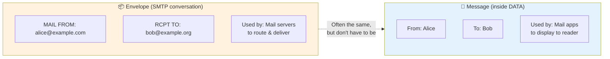
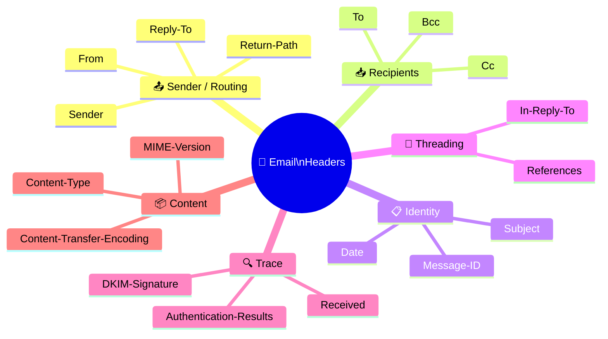
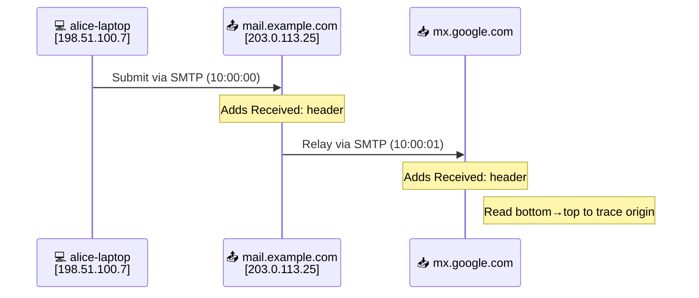
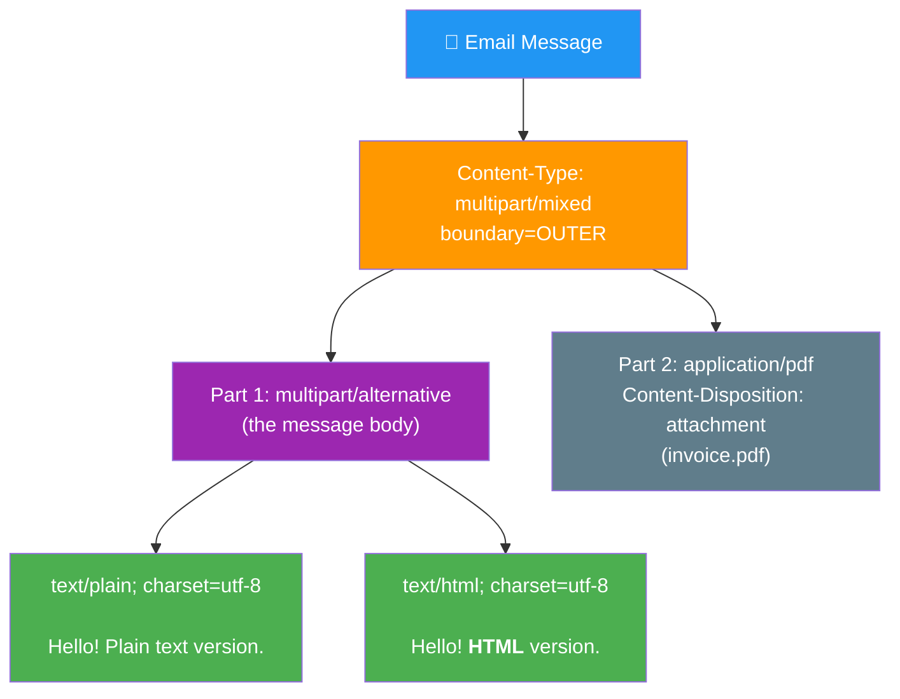
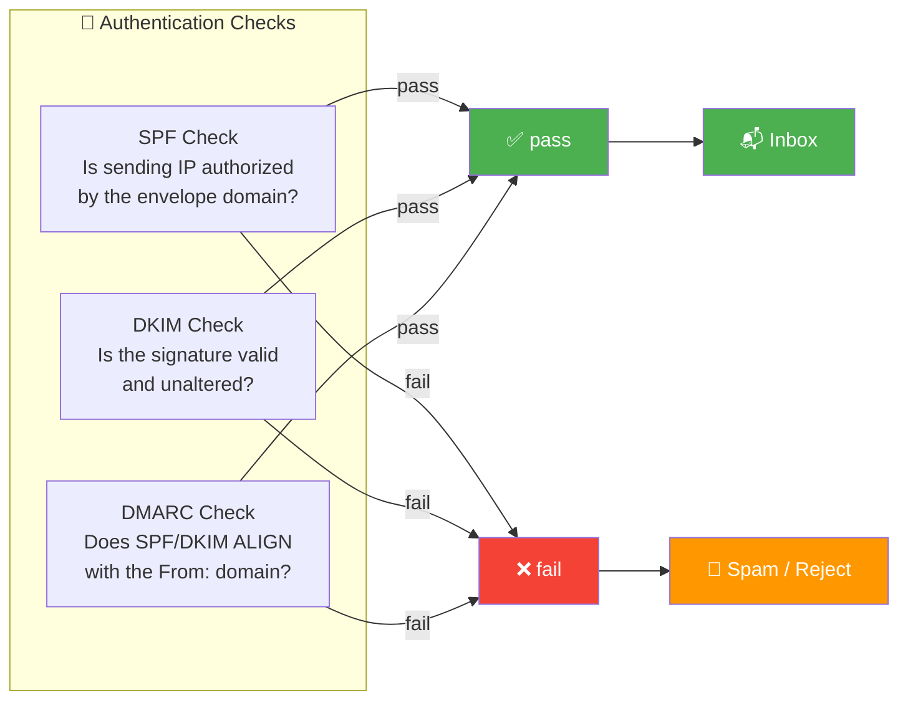

# Anatomy of an Email

An email looks like a single thing in your inbox, but under the hood it is a precisely
structured text document wrapped in a delivery envelope. This reference takes a real
message apart, header by header, so you can read raw mail and understand what every
field is for.

The formats are defined by **RFC 5322** (message format) and the **MIME** family
(RFC 2045–2049, for attachments and non-ASCII content).

---

## Table of Contents

1. [Envelope vs. Message](#envelope-vs-message)
2. [The Structure of a Message](#the-structure-of-a-message)
3. [Headers You'll See Most](#headers-youll-see-most)
4. [Reading the `Received:` Trail](#reading-the-received-trail)
5. [MIME: Attachments and Rich Content](#mime-attachments-and-rich-content)
6. [Encoding Non-ASCII Text](#encoding-non-ascii-text)
7. [The `Authentication-Results` Header](#the-authentication-results-header)
8. [A Fully Annotated Raw Email](#a-fully-annotated-raw-email)

---

## Envelope vs. Message

The single most clarifying idea about email: there are **two** "from" and "to"
addresses, and they serve different purposes.



| | **The Envelope** | **The Message** |
|---|---|---|
| Set during | SMTP conversation (`MAIL FROM` / `RCPT TO`) | The message text itself (`From:` / `To:` headers) |
| Used by | Mail servers, to **route and deliver** | Mail apps, to **display** |
| Analogy | The address written on a postal envelope | The "Dear …, Sincerely, …" inside the letter |

**Why the gap matters:**

- **Mailing lists** keep your `From:` in the message but use the list's address as the envelope sender, so bounces go to the list.
- **Bounce messages (NDRs)** are sent to the *envelope* sender (the "return path"), not the `From:` header.
- **Spoofing** is forging the `From:` header — **SPF** checks the *envelope* sender's domain, which is why SPF alone doesn't stop display-name spoofing. **DMARC alignment** handles that.

The envelope vanishes once delivery completes; only the message (with its `Received:` trail) is stored.

---

## The Structure of a Message

Every RFC 5322 message is simple at the top level:

```text
HEADERS
Name: value
Name: value
...

(blank line)  ← separates headers from body

BODY
Everything after the blank line
```

- **Headers** come first, one per line, as `Name: value`
- **A single blank line** separates headers from body — get this wrong and the rest of your headers become body text
- **The body** is everything after it

### Header Folding

Long header values may be split across lines by inserting a newline before whitespace:

```text
Subject: A short subject

Subject: A much longer subject that has
 been folded onto a second line
```

A line that begins with a space or tab is a **continuation** of the header above it.

---

## Headers You'll See Most



| Header | Purpose |
|--------|---------|
| `From:` | Author shown to the reader (display name + address) |
| `To:`, `Cc:` | Primary and carbon-copy recipients (visible) |
| `Bcc:` | Blind copies — stripped before delivery, never shown to others |
| `Subject:` | The subject line |
| `Date:` | When the author sent it (RFC 5322 format) |
| `Message-ID:` | Globally unique ID like `<abc123@example.com>` — used for threading and dedup |
| `In-Reply-To:` / `References:` | Point to `Message-ID`(s) being replied to — how threads are built |
| `Reply-To:` | Where replies should go, if different from `From:` |
| `Return-Path:` | The envelope sender, recorded by receiving server (where bounces go) |
| `Received:` | Trace stamp added by each server the message passes through |
| `Content-Type:` | What kind of content the body is |
| `MIME-Version:` | Declares the message uses MIME (`1.0`) |

> **Trust nothing above the line you control.** A sender can put anything in `From:`,
> `Date:`, or `Message-ID:`. Only headers added by *receiving* servers (`Received:`,
> `Return-Path:`, `Authentication-Results:`) reflect what actually happened.

---

## Reading the `Received:` Trail

Each MTA that handles a message **prepends** a `Received:` header. Because they're
added to the top, the trail reads **bottom-to-top in time**:

```
Received: from mail.example.com (mail.example.com [203.0.113.25])
        by mx.google.com with ESMTPS id abc123
        for <bob@gmail.com>; Tue, 20 May 2026 10:00:02 -0700  ← newest (TOP)
Received: from alice-laptop (cpe-…[198.51.100.7])
        by mail.example.com with ESMTPSA id def456;
        Tue, 20 May 2026 10:00:00 -0700                        ← oldest (BOTTOM)
```



**Use the `Received:` trail to answer:**
- Where did this really originate?
- How long did each hop take?
- Does the path make sense, or did the message appear out of nowhere?

---

## MIME: Attachments and Rich Content

Plain RFC 5322 only allows 7-bit ASCII text. **MIME** (Multipurpose Internet Mail
Extensions) lets email carry HTML, images, attachments, and non-ASCII text — by
labeling parts with a `Content-Type` and splitting the body into sections.



Two `Content-Type` values you'll meet constantly:

| Type | Usage | Behavior |
|------|-------|----------|
| `multipart/alternative` | Same content in multiple formats (plain + HTML) | App shows the richest one it can render |
| `multipart/mixed` | Different parts bundled (body + attachments) | Each part can be a different type |

Parts are separated by a **boundary** string declared in the header:

```text
Content-Type: multipart/mixed; boundary="OUTER"

--OUTER
Content-Type: multipart/alternative; boundary="INNER"

--INNER
Content-Type: text/plain; charset="utf-8"

Hello! This is the plain-text version.
--INNER
Content-Type: text/html; charset="utf-8"

<p>Hello! This is the <b>HTML</b> version.</p>
--INNER--
--OUTER
Content-Type: application/pdf; name="invoice.pdf"
Content-Transfer-Encoding: base64
Content-Disposition: attachment; filename="invoice.pdf"

JVBERi0xLjcKJeLjz9MK...
--OUTER--
```

`Content-Disposition: attachment` tells the client to offer a download rather than display inline.

---

## Encoding Non-ASCII Text

Mail historically traveled over 7-bit channels, so binary and non-ASCII data must be encoded into ASCII. `Content-Transfer-Encoding` specifies how:

| ENCODING | BEST FOR | HOW IT LOOKS |
|---|---|---|
| 7bit | Plain ASCII text | Unchanged |
| quoted-printable | Mostly-ASCII with a few<br>special chars | Café → Caf=C3=A9<br>(= byte values) |
| base64 | Binary (images, PDFs) | JVBERi0xLjcK... |

**Headers** can't hold raw UTF-8 either — non-ASCII subjects/names use *encoded-words* (RFC 2047):

```text
Subject: =?utf-8?B?8J+TpyBIZWxsbw==?=
         └ charset ┘ └encoding┘ └─ base64 payload ─┘
                                   decodes to: 📧 Hello
```

- `B` = base64
- `Q` = quoted-printable

Mail apps decode these back to readable text automatically.

---

## The `Authentication-Results` Header

When a receiving server runs SPF, DKIM, and DMARC checks, it records the verdicts in
an `Authentication-Results` header — the trustworthy summary of whether the message is genuine:



```text
Authentication-Results: mx.google.com;
       spf=pass    (google.com: domain of alice@example.com designates
                    203.0.113.25 as permitted sender) smtp.mailfrom=alice@example.com;
       dkim=pass   header.i=@example.com header.s=dkim;
       dmarc=pass  (p=REJECT sp=REJECT dis=NONE) header.from=example.com
```

| Result | What It Means |
|--------|--------------|
| `spf=pass` | The *envelope* sender's domain authorized the sending IP |
| `dkim=pass` | The message's signature is valid and unaltered |
| `dmarc=pass` | SPF or DKIM passed **and** *aligned* with the `From:` domain — the part that actually stops `From:` spoofing |

> **This is the first header to read** when diagnosing "why did my mail go to spam?"
> See [Troubleshooting](TROUBLESHOOTING.md) for next steps.

---

## A Fully Annotated Raw Email

Putting it all together — a complete, minimal message as it sits on disk:

```text
Return-Path: <alice@example.com>           ← envelope sender (added by receiver)
Received: from mail.example.com (...)      ← trace stamp (newest first)
        by mx.example.org; Tue, 20 May 2026 10:00:02 -0700
Authentication-Results: mx.example.org;   ← the trustworthy verdicts
        spf=pass dkim=pass dmarc=pass
DKIM-Signature: v=1; a=rsa-sha256; d=example.com; s=dkim; ... ← signature itself
MIME-Version: 1.0                          ← "this message uses MIME"
Date: Tue, 20 May 2026 10:00:00 -0700
Message-ID: <a1b2c3@example.com>          ← unique id (threading/dedup)
From: Alice <alice@example.com>           ← author shown to reader
To: Bob <bob@example.org>
Subject: =?utf-8?Q?Caf=C3=A9_meeting?=   ← encoded-word: "Café meeting"
Content-Type: multipart/alternative; boundary="X"
                                          ← blank line ends headers ↓
--X
Content-Type: text/plain; charset="utf-8"

See you at the café at noon.
--X
Content-Type: text/html; charset="utf-8"

<p>See you at the <b>café</b> at noon.</p>
--X--
```

**Read top to bottom:**
1. Receiver-added trust headers (`Return-Path`, `Received`, `Authentication-Results`, `DKIM-Signature`)
2. Sender-provided headers (`MIME-Version`, `Date`, `Message-ID`, `From`, `To`, `Subject`, `Content-Type`)
3. The blank line
4. The MIME body in two alternative formats

Once you can read this, you can read any email.

---

### See Also

- [← Overview](OVERVIEW.md) · [Protocols by Hand](PROTOCOLS.md)

[← Back to index](../../README.md)
