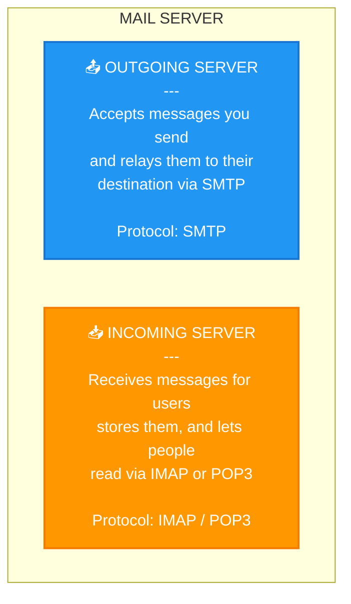
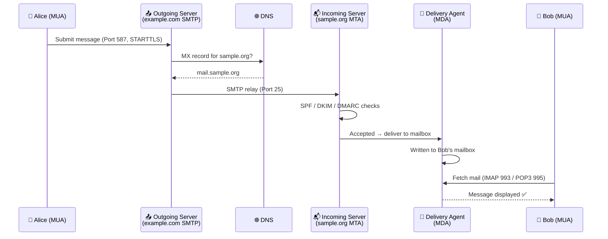
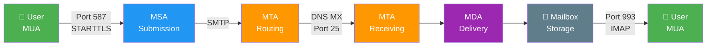
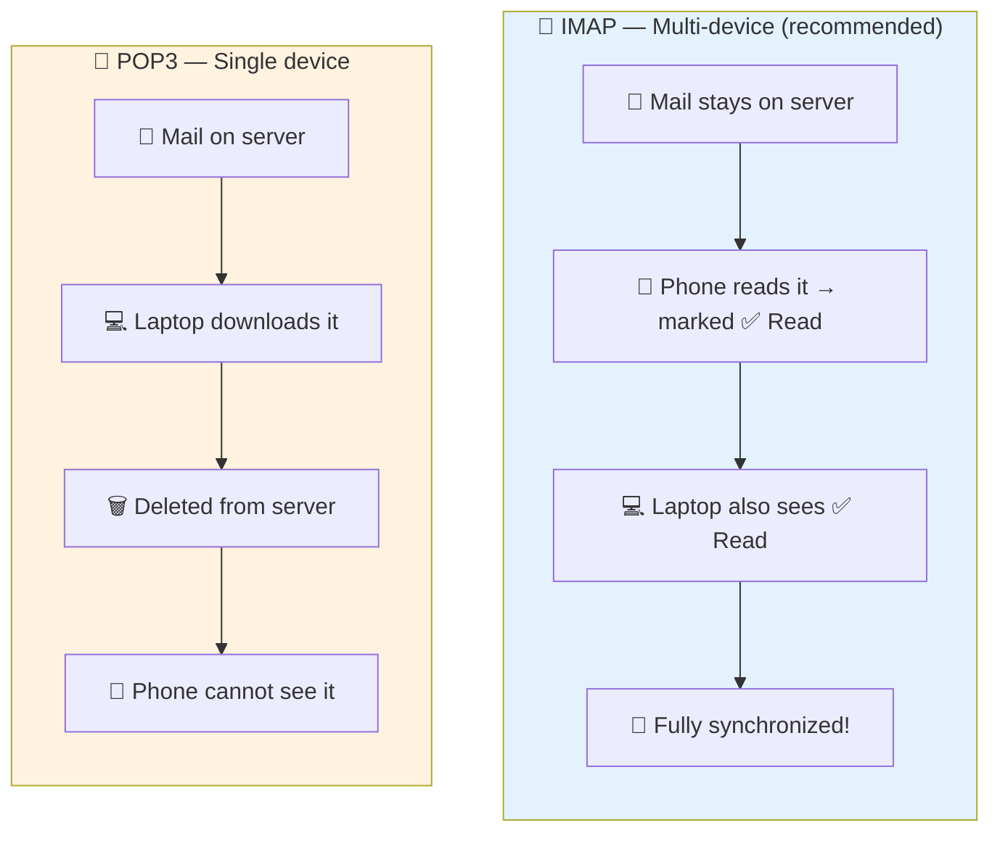
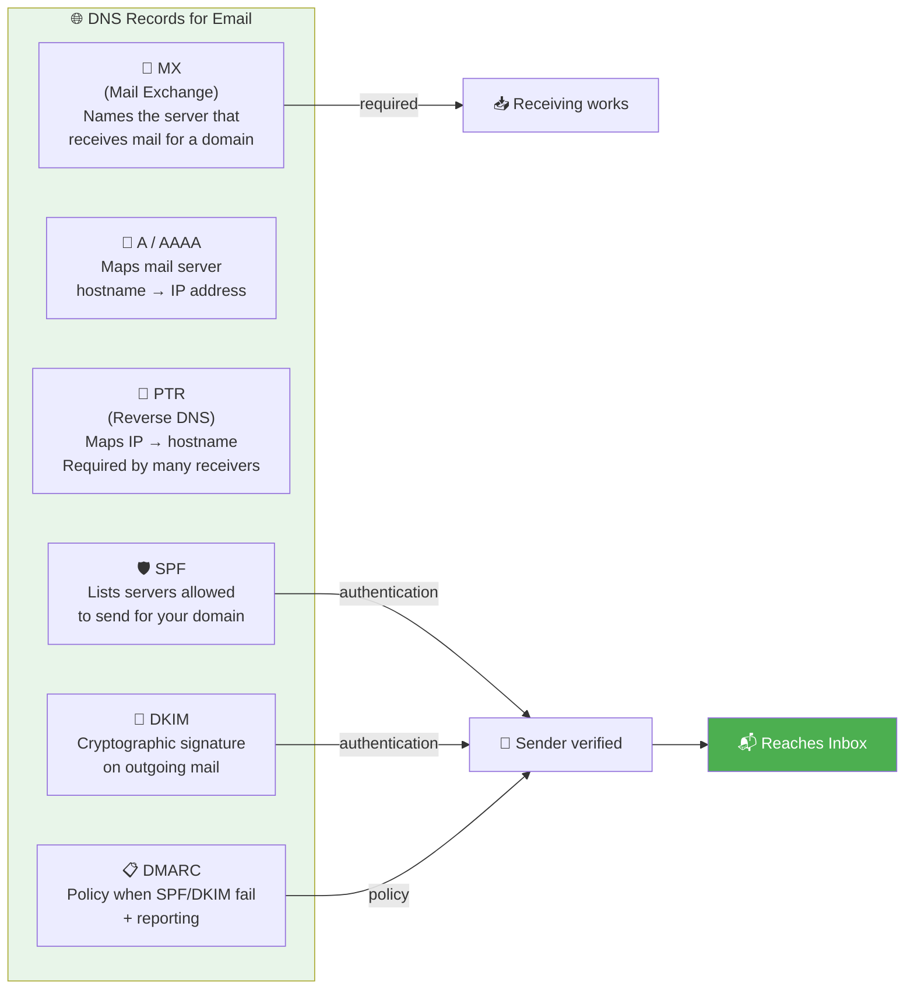
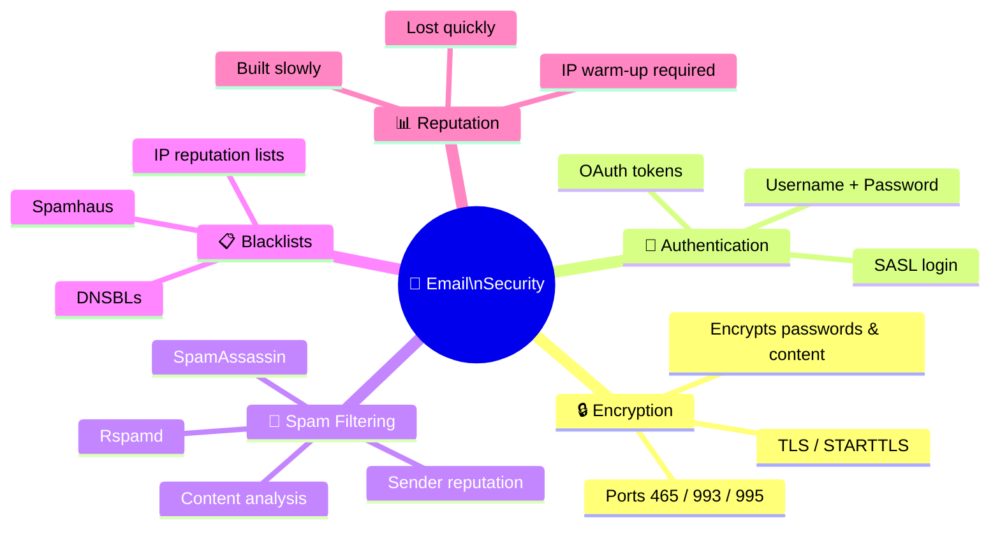
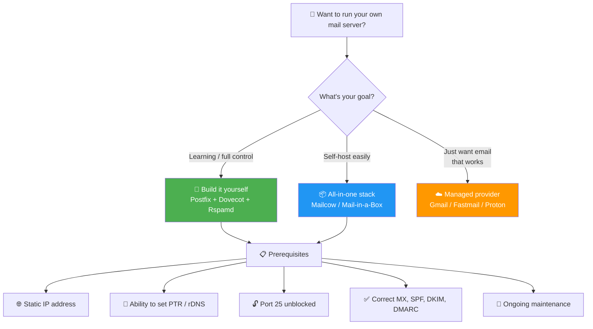
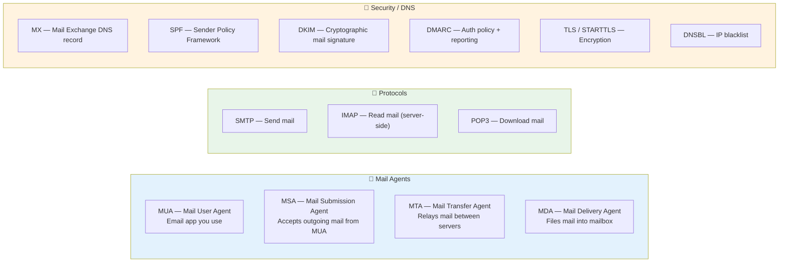

# Mail Server — What It Is and What It Does

A **mail server** is a computer (or program running on one) whose job is to
**send, receive, store, and forward email** on behalf of its users. Every time
you press "Send" in Gmail, Outlook, or any other email app, a chain of mail
servers quietly carries your message across the internet and drops it into the
recipient's inbox.

---

## Table of Contents

1. [What is a Mail Server?](#what-is-a-mail-server)
2. [End-to-End Email Flow](#end-to-end-email-flow)
3. [Core Components](#core-components)
4. [Key Protocols & Ports](#key-protocols--ports)
5. [DNS Records That Make Email Work](#dns-records-that-make-email-work)
6. [Security & Spam](#security--spam)
7. [Self-Hosting Basics](#self-hosting-basics)
8. [Glossary](#glossary)

---

## What is a Mail Server?

Think of a mail server as a **digital post office**. When you mail a physical
letter, you hand it to the post office — it figures out the route, passes it
between sorting facilities, and delivers it to the right mailbox.

A mail server performs **two cooperating roles**:



---

## End-to-End Email Flow

Suppose **alice@example.com** sends an email to **bob@sample.org**:



### Step-by-Step Breakdown

| Step | What Happens |
|------|-------------|
| **1. Compose & Submit** | Alice writes the message; the app submits it to her provider's outgoing server over **SMTP** (port 587, authenticated) |
| **2. Look up destination** | Alice's server queries DNS for the MX record of `sample.org` |
| **3. Server-to-server transfer** | Alice's server opens an SMTP connection to `sample.org`'s server (port 25) |
| **4. Acceptance & filtering** | Bob's server checks SPF/DKIM/DMARC, runs spam filtering, accepts or rejects |
| **5. Delivery to mailbox** | A **delivery agent (MDA)** files the message into Bob's mailbox |
| **6. Bob reads it** | Bob's app retrieves the message via **IMAP** (port 993) or **POP3** (port 995) |

> **Key insight:** Servers talk to each other via **SMTP**; users read their mail via **IMAP / POP3**.

---

## Core Components



| Component | Full Name | Role | Example Software |
|-----------|-----------|------|-----------------|
| **MUA** | Mail User Agent | The app a person uses to read/write email | Thunderbird, Apple Mail, Gmail, Outlook |
| **MSA** | Mail Submission Agent | Accepts outgoing mail from a MUA (port 587) | Postfix `submission` |
| **MTA** | Mail Transfer Agent | Routes and relays mail between servers over SMTP | Postfix, Exim, Sendmail |
| **MDA** | Mail Delivery Agent | Files accepted messages into the correct local mailbox | Dovecot LDA, Procmail |
| **Mailbox store** | — | Where messages physically live (files or database) | Maildir, mbox |
| **Access server** | — | Serves stored mail to MUAs via IMAP/POP3 | Dovecot, Courier |

> **Classic self-hosted pair:** **Postfix** (handles SMTP) + **Dovecot** (handles IMAP/POP3 + delivery)

---

## Key Protocols & Ports

| PROTOCOL | PLAIN | ENCRYPTED | PURPOSE |
|---|---|---|---|
| **SMTP** | 25<br>(server) | 465 (TLS)<br>587 (STARTTLS) | Send mail:<br>25 = server relay<br>587 = client submission |
| **IMAP** | 143 | 993 (TLS) | Read mail kept on the server<br>Syncs across all devices |
| **POP3** | 110 | 995 (TLS) | Download mail to one device<br>Usually deletes from server |

### IMAP vs POP3 — Which to Use?



> **Use IMAP** for multiple devices — it's what nearly everyone uses today.
> **Port 25** is for server-to-server relay and is often blocked by ISPs to fight spam.
> **Port 587** with authentication is what your mail *app* uses to submit new mail.

---

## DNS Records That Make Email Work

Email delivery depends heavily on **DNS** (the internet's address book).



| Record | What It Does | Why It Matters |
|--------|-------------|----------------|
| **MX** | Names the server(s) that receive mail for a domain, with priority | Without it, no one can deliver mail to your domain |
| **A / AAAA** | Maps the mail server's hostname to its IPv4 / IPv6 address | The MX record points to a hostname; this resolves it to an IP |
| **PTR** | Maps the server's IP back to its hostname | Many receivers reject mail from IPs without matching reverse DNS |
| **SPF** | Lists which servers are allowed to send mail for your domain | Stops others from forging your domain as the sender |
| **DKIM** | Adds a cryptographic signature to your outgoing mail | Lets receivers verify the message wasn't altered |
| **DMARC** | Tells receivers what to do when SPF/DKIM checks fail | Ties SPF + DKIM together into an enforceable policy |

### Example DNS Records

```dns
; Where to deliver mail for example.com
example.com.        IN  MX   10 mail.example.com.
mail.example.com.   IN  A    203.0.113.25

; SPF: only this server may send mail as example.com
example.com.        IN  TXT  "v=spf1 mx -all"

; DKIM: public key for signature verification (selector "s1")
s1._domainkey.example.com.  IN  TXT  "v=DKIM1; k=rsa; p=MIGfMA0GCSq..."

; DMARC: reject failures, email reports to the postmaster
_dmarc.example.com. IN  TXT  "v=DMARC1; p=reject; rua=mailto:postmaster@example.com"
```

---

## Security & Spam



| Security Layer | Description |
|----------------|-------------|
| **TLS / STARTTLS encryption** | Mail connections are encrypted so messages and passwords aren't sent in plain text |
| **SASL authentication** | Before relaying mail, the server verifies your identity — prevents **open relay** abuse |
| **Spam filtering** | Incoming mail is scored using content analysis and authentication results |
| **DNSBLs (blacklists)** | Published lists of known-bad IPs — if your server's IP is listed, mail gets blocked everywhere |
| **Deliverability** | Even a perfect config can land in spam if the IP is new or volume spikes suddenly |

---

## Self-Hosting Basics



### Self-Host vs Managed Provider

| Feature | Self-Hosted | Managed Provider<br>(Gmail, Fastmail, etc.) |
|---|---|---|
| **Control/Privacy** | Full control of data | Provider holds your data |
| **Cost** | Server cost + time | Monthly per-user fee |
| **Setup difficulty** | High (DNS, TLS, spam) | Minimal |
| **Deliverability** | Build IP reputation | Established reputation out of box |
| **Maintenance** | Ongoing — on you | Handled for you |

> For most people and businesses, a **managed provider** is the pragmatic choice.
> Self-hosting is worth it for learning, full data ownership, or specialized needs —
> just budget for the operational effort.

---

## Glossary



| Term | Definition |
|------|-----------|
| **MUA** | Mail User Agent — the email app you use |
| **MSA** | Mail Submission Agent — accepts outgoing mail from a MUA |
| **MTA** | Mail Transfer Agent — relays mail between servers |
| **MDA** | Mail Delivery Agent — files mail into the correct mailbox |
| **SMTP** | Simple Mail Transfer Protocol — sends mail |
| **IMAP** | Internet Message Access Protocol — reads mail kept on the server |
| **POP3** | Post Office Protocol v3 — downloads mail to one device |
| **MX record** | DNS record naming a domain's mail servers |
| **SPF** | Sender Policy Framework — authorizes sending servers |
| **DKIM** | DomainKeys Identified Mail — cryptographically signs mail |
| **DMARC** | Domain-based Message Authentication, Reporting & Conformance |
| **TLS / STARTTLS** | Encryption for mail connections |
| **DNSBL** | DNS Blacklist of bad sender IPs |
| **Open relay** | Misconfigured server that forwards mail for anyone (abused by spammers) |

---

### See Also

- **Next:** [Cloud Providers & Infrastructure →](CLOUD_PROVIDERS.md)
- [Self-Hosting a Mail Server](SELF_HOSTING.md)
- [Anatomy of an Email](EMAIL_ANATOMY.md)
- [Speaking the Protocols by Hand](PROTOCOLS.md)
- [Choosing Mail Server Software](CHOOSING_SOFTWARE.md)

[← Back to index](../../README.md)
