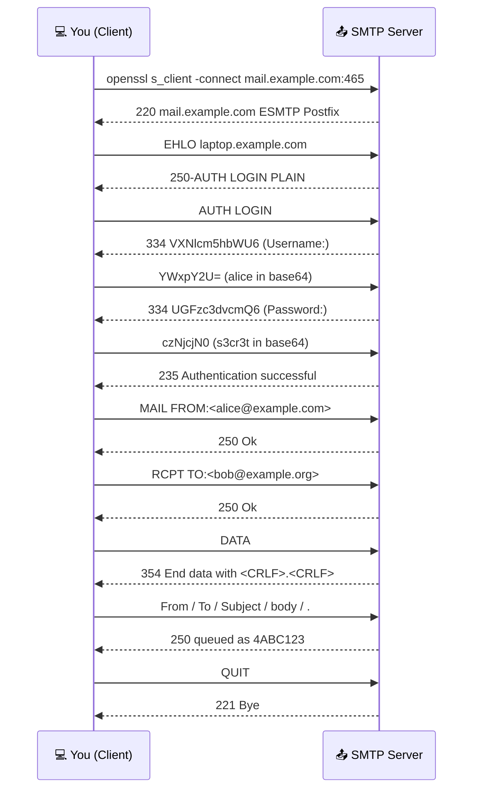
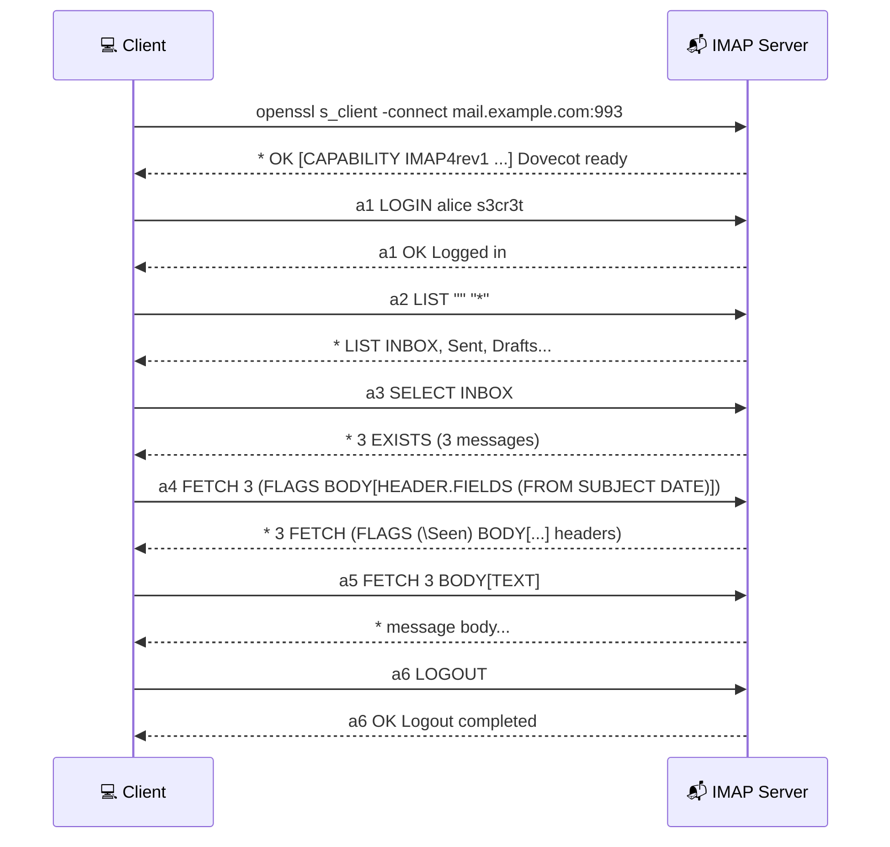
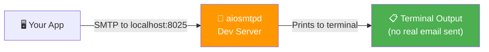

# Speaking the Protocols by Hand

Email protocols are plain-text and human-readable — you can literally type them at a
server and watch it respond. This guide first does that manually (great for understanding
and debugging), then builds the same flows in **Python** using only the standard library.

> The transcripts below use `C:` for what *you* (the client) send and `S:` for the
> server's replies. Replace hostnames, addresses, and credentials with your own.

---

## Table of Contents

1. [SMTP by Hand (Sending)](#smtp-by-hand-sending)
2. [IMAP by Hand (Reading)](#imap-by-hand-reading)
3. [POP3 by Hand (Downloading)](#pop3-by-hand-downloading)
4. [Sending Mail from Python (`smtplib`)](#sending-mail-from-python-smtplib)
5. [Reading Mail from Python (`imaplib`)](#reading-mail-from-python-imaplib)
6. [A Debugging SMTP Server (`aiosmtpd`)](#a-debugging-smtp-server-aiosmtpd)

---

## SMTP by Hand (Sending)

SMTP submission runs on port **587** (STARTTLS) or **465** (implicit TLS).
Because real servers require TLS, connect with `openssl s_client`:



```bash
openssl s_client -connect mail.example.com:465 -quiet
```

Full SMTP dialog:

```text
S: 220 mail.example.com ESMTP Postfix
C: EHLO laptop.example.com
S: 250-mail.example.com
S: 250-AUTH LOGIN PLAIN
S: 250 STARTTLS
C: AUTH LOGIN
S: 334 VXNlcm5hbWU6              (base64 for "Username:")
C: YWxpY2U=                      (base64 for "alice")
S: 334 UGFzc3dvcmQ6              (base64 for "Password:")
C: czNjcjN0                      (base64 for "s3cr3t")
S: 235 2.7.0 Authentication successful
C: MAIL FROM:<alice@example.com>
S: 250 2.1.0 Ok
C: RCPT TO:<bob@example.org>
S: 250 2.1.5 Ok
C: DATA
S: 354 End data with <CR><LF>.<CR><LF>
C: From: Alice <alice@example.com>
C: To: Bob <bob@example.org>
C: Subject: Hand-typed mail
C:
C: Hello, typed straight into SMTP.
C: .
S: 250 2.0.0 Ok: queued as 4ABC123
C: QUIT
S: 221 2.0.0 Bye
```

> - `MAIL FROM` / `RCPT TO` are the **envelope** (routing); `From:`/`To:` inside `DATA` are just headers for the reader.
> - **A lone `.` on its own line ends the message.**
> - Generate base64 credentials with: `printf 'alice' | base64`

### Reading SMTP Reply Codes

| Code | Class | Meaning |
|---|---|---|
| 2xx | ✅ Success | Accepted (250 OK, 235 auth ok) |
| 3xx | ⏳ Intermediate | Server wants more (354 send your data) |
| 4xx | ⚠️ Temp failure | Try again later (451, 421) — message queued |
| 5xx | ❌ Perm failure | Rejected (550 no such user, 554 blocked) |

> **4xx vs 5xx matters:** temporary failures retry automatically; permanent ones bounce immediately.

---

## IMAP by Hand (Reading)

IMAP (port **993**, implicit TLS) keeps mail on the server. Each command is prefixed
with a *tag* you choose (`a1`, `a2`, …) so replies can be matched to commands.



```bash
openssl s_client -connect mail.example.com:993 -quiet
```

```text
S: * OK [CAPABILITY IMAP4rev1 ...] Dovecot ready.
C: a1 LOGIN alice s3cr3t
S: a1 OK Logged in
C: a2 LIST "" "*"
S: * LIST (\HasNoChildren) "/" INBOX
S: * LIST (\HasNoChildren) "/" Sent
S: a2 OK List completed
C: a3 SELECT INBOX
S: * 3 EXISTS                     (3 messages in INBOX)
S: a3 OK [READ-WRITE] Select completed
C: a4 FETCH 3 (FLAGS BODY[HEADER.FIELDS (FROM SUBJECT DATE)])
S: * 3 FETCH (FLAGS (\Seen) BODY[HEADER.FIELDS (FROM SUBJECT DATE)] {84}
S:   From: Bob <bob@example.org>
S:   Subject: Re: lunch
S:   Date: Tue, 20 May 2026 09:00:00 -0700
S:   )
S: a4 OK Fetch completed
C: a5 FETCH 3 BODY[TEXT]
S: ...
C: a6 LOGOUT
S: a6 OK Logout completed
```

`SELECT` opens a folder; `FETCH` retrieves whole messages or just specific parts.
The `\Seen` flag syncs to every device — that's IMAP's key advantage.

---

## POP3 by Hand (Downloading)

POP3 (port **995**) is the simple, one-device download protocol:

```bash
openssl s_client -connect mail.example.com:995 -quiet
```

```text
S: +OK Dovecot ready.
C: USER alice
S: +OK
C: PASS s3cr3t
S: +OK Logged in.
C: STAT
S: +OK 3 4521                    (3 messages, 4521 bytes total)
C: RETR 1                        (download message 1)
S: +OK 1502 octets
S: ... full message ...
S: .
C: DELE 1                        (mark for deletion on QUIT)
S: +OK
C: QUIT
S: +OK Logging out, messages deleted.
```

POP3 replies are just `+OK` / `-ERR` — much simpler than IMAP, but no folders and no cross-device sync.

---

## Sending Mail from Python (`smtplib`)

The standard library handles STARTTLS, auth, and the entire dialog.
`email.message.EmailMessage` builds a correct MIME message:

```python
import smtplib
from email.message import EmailMessage

msg = EmailMessage()
msg["From"] = "Alice <alice@example.com>"
msg["To"] = "bob@example.org"
msg["Subject"] = "Sent from Python"
msg.set_content("Hello — this is the plain-text body.")

# Add an HTML alternative (creates multipart/alternative automatically)
msg.add_alternative("<p>Hello — this is the <b>HTML</b> body.</p>", subtype="html")

# Submission port 587 with STARTTLS
with smtplib.SMTP("mail.example.com", 587) as smtp:
    smtp.starttls()
    smtp.login("alice", "s3cr3t")
    smtp.send_message(msg)

print("sent")
```

To attach a file:

```python
with open("invoice.pdf", "rb") as f:
    msg.add_attachment(f.read(), maintype="application",
                       subtype="pdf", filename="invoice.pdf")
```

`set_content` + `add_alternative` produce the exact `multipart/alternative` structure
described in [Email Anatomy](EMAIL_ANATOMY.md).

---

## Reading Mail from Python (`imaplib`)

`imaplib` speaks IMAP; the `email` module parses what comes back into objects:

```python
import imaplib
import email
from email.header import make_header, decode_header

with imaplib.IMAP4_SSL("mail.example.com", 993) as M:
    M.login("alice", "s3cr3t")
    M.select("INBOX")

    # Search for unseen messages
    typ, data = M.search(None, "UNSEEN")
    for num in data[0].split():
        typ, raw = M.fetch(num, "(RFC822)")      # full raw message
        msg = email.message_from_bytes(raw[0][1])

        subject = make_header(decode_header(msg["Subject"]))  # decode encoded-words
        print(f"From: {msg['From']}  Subject: {subject}")

        # Walk MIME parts to find the plain-text body
        if msg.is_multipart():
            for part in msg.walk():
                if part.get_content_type() == "text/plain":
                    print(part.get_content())
                    break
        else:
            print(msg.get_content())
```

`decode_header` + `make_header` turn `=?utf-8?B?...?=` encoded-words back into readable text.
`msg.walk()` iterates every MIME part so you can pick the one you want.

---

## A Debugging SMTP Server (`aiosmtpd`)

When developing an app that *sends* mail, you don't want it hitting real inboxes.
A throwaway local SMTP server that just prints whatever it receives is invaluable.



```bash
pip install aiosmtpd        # not in the stdlib
```

Quickest version — prints received messages to the console:

```bash
python3 -m aiosmtpd -n -l localhost:8025
```

Or with full control over what happens to each message:

```python
# devserver.py — run:  python3 devserver.py
import asyncio
from aiosmtpd.controller import Controller

class Printer:
    async def handle_DATA(self, server, session, envelope):
        print("=" * 60)
        print("MAIL FROM:", envelope.mail_from)      # envelope sender
        print("RCPT TO:  ", envelope.rcpt_tos)       # envelope recipients
        print("-" * 60)
        print(envelope.content.decode("utf-8", "replace"))  # full raw message
        return "250 Message accepted for delivery"

controller = Controller(Printer(), hostname="localhost", port=8025)
controller.start()
print("Dev SMTP on localhost:8025 — Ctrl+C to stop")
try:
    asyncio.get_event_loop().run_forever()
except KeyboardInterrupt:
    controller.stop()
```

Point your app's SMTP settings at `localhost:8025` (no TLS, no auth) and every message
it tries to send lands in your terminal — envelope and all.

> **Note.** `smtplib`, `imaplib`, and `email` are all in the Python standard library —
> no install needed. Only `aiosmtpd` requires `pip install`.

---

### See Also

- [← Email Anatomy](EMAIL_ANATOMY.md) · [Troubleshooting & Ops](TROUBLESHOOTING.md)
- [Self-Hosting Guide](SELF_HOSTING.md) — to run a real server to point these at

[← Back to index](../../README.md)
