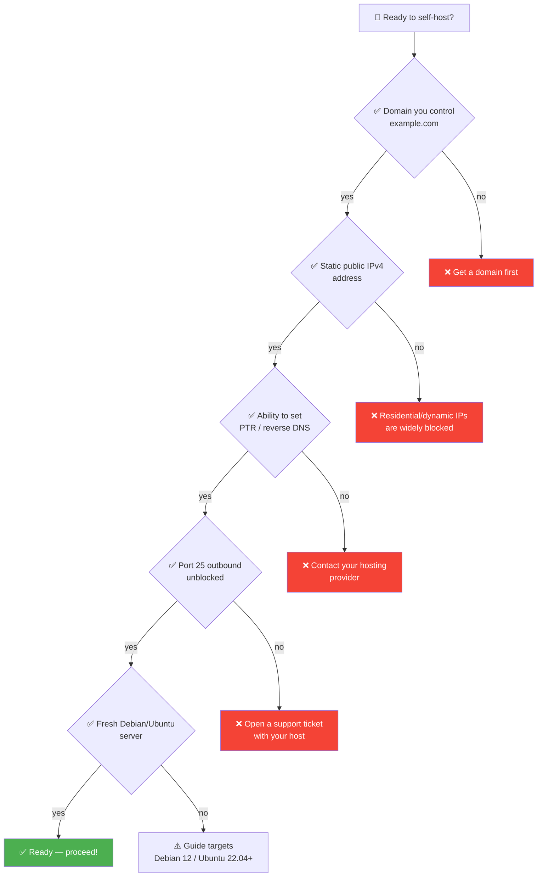
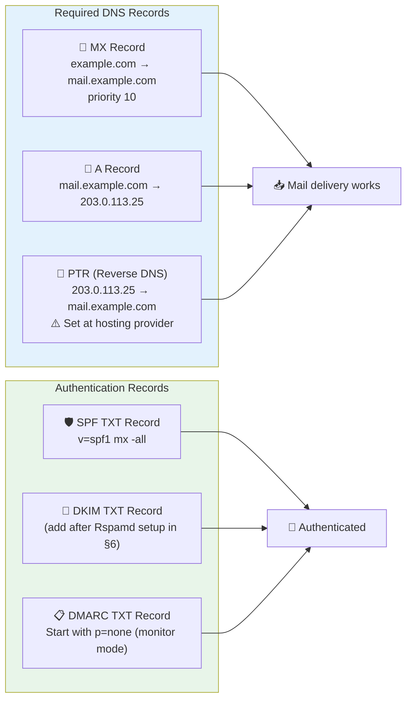
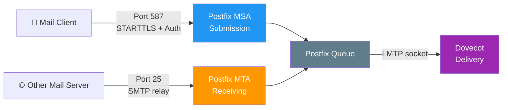
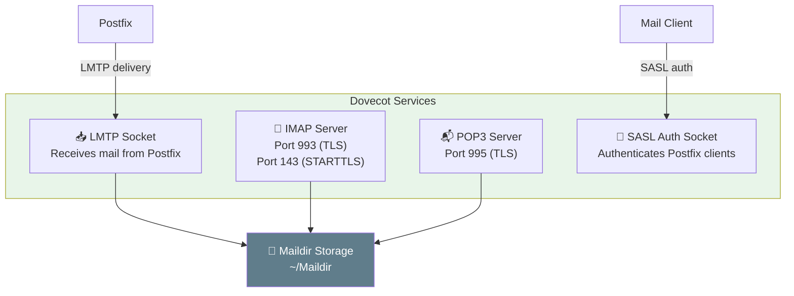
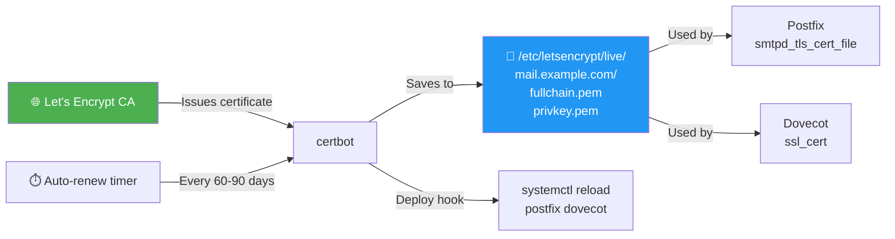
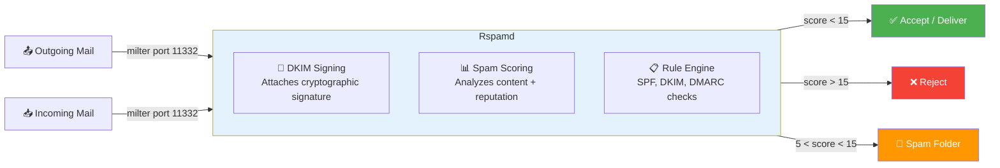
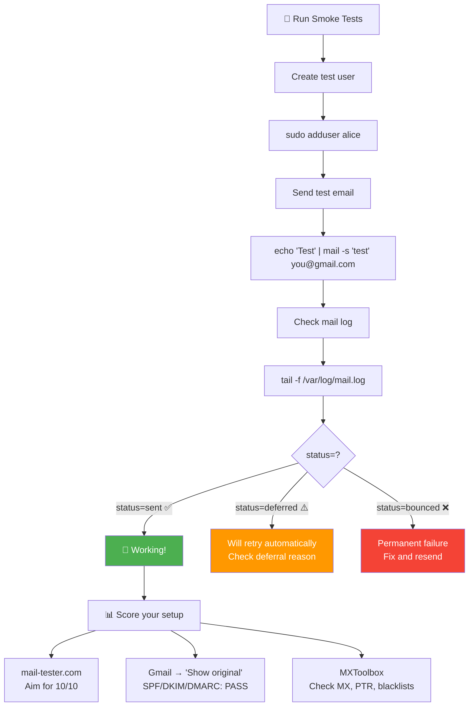
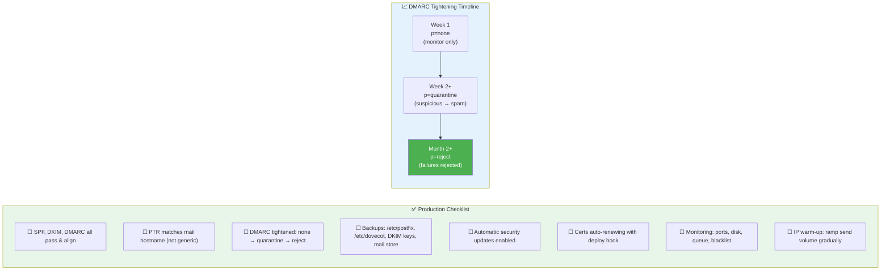

# Self-Hosting a Mail Server — Hands-On Guide

This guide walks through standing up a working mail server for a single domain on a
fresh Linux box, using the classic open-source stack: **Postfix** (SMTP) +
**Dovecot** (IMAP/POP3 + delivery), with **Let's Encrypt** for TLS and **Rspamd** for
DKIM signing and spam filtering.

> **Heads up.** Every command and config snippet below is **illustrative**. Versions,
> file paths, and defaults drift between distributions and releases — always check the
> official [Postfix](https://www.postfix.org/documentation.html) and
> [Dovecot](https://doc.dovecot.org/) docs for your version.
> If you just want email that works, see [Choosing Software](CHOOSING_SOFTWARE.md).

---

## Table of Contents

1. [Prerequisites](#prerequisites)
2. [Set Up DNS](#set-up-dns)
3. [Install Postfix (SMTP)](#install-postfix-smtp)
4. [Install Dovecot (IMAP/POP3 + Delivery)](#install-dovecot-imappop3--delivery)
5. [TLS Certificates with Let's Encrypt](#tls-certificates-with-lets-encrypt)
6. [DKIM Signing & Spam Filtering with Rspamd](#dkim-signing--spam-filtering-with-rspamd)
7. [Smoke Tests](#smoke-tests)
8. [Going to Production Checklist](#going-to-production-checklist)

---

## Prerequisites

Before installing anything, verify **all** of the following. Missing even one is the
usual reason a setup never delivers.



| Requirement | Why It Matters |
|------------|----------------|
| **Domain you control** | You must be able to set DNS records |
| **Static public IPv4** | Residential/dynamic IPs are widely blocked for mail |
| **Ability to set reverse DNS (PTR)** | Configured at your **hosting provider**, not your DNS panel — PTR must match your mail hostname |
| **Outbound port 25 unblocked** | Many providers (AWS, GCP, Oracle) block port 25 by default — open it first |
| **Fresh Debian/Ubuntu server** | This guide assumes Debian 12 / Ubuntu 22.04+ |

Set the system hostname first:

```bash
sudo hostnamectl set-hostname mail.example.com
```

---

## Set Up DNS

DNS makes your domain reachable and your mail trustworthy. Set these records at your
DNS provider **before** installing any software.



```dns
; --- Reachability ---
example.com.        IN  MX   10 mail.example.com.
mail.example.com.   IN  A    203.0.113.25
mail.example.com.   IN  AAAA 2001:db8::25    ; only if you have working IPv6

; --- Authentication ---
; SPF: only this server may send as example.com
example.com.        IN  TXT  "v=spf1 mx -all"

; DKIM: published AFTER Rspamd generates the key (see §6)
; dkim._domainkey.example.com. IN TXT "v=DKIM1; k=rsa; p=MIGfMA0..."

; DMARC: start in monitor mode, tighten later
_dmarc.example.com. IN  TXT  "v=DMARC1; p=none; rua=mailto:dmarc@example.com"
```

**Reverse DNS (PTR)** is set at your *hosting* provider's control panel (not in your DNS zone):

```
203.0.113.25  →  mail.example.com
```

### Verify with `dig`

```bash
dig +short MX    example.com           # → 10 mail.example.com.
dig +short A     mail.example.com      # → 203.0.113.25
dig +short TXT   example.com           # → "v=spf1 mx -all"
dig +short TXT   _dmarc.example.com    # → "v=DMARC1; p=none; ..."
dig +short -x    203.0.113.25          # PTR → mail.example.com. (must match!)
```

> **Start DMARC at `p=none`** — this monitors without affecting delivery. Once reports
> show SPF + DKIM passing and aligned, move to `p=quarantine`, then `p=reject`.

---

## Install Postfix (SMTP)

Postfix is the **MTA/MSA** — it accepts mail you submit (port 587) and relays mail to
and from other servers (port 25).



```bash
sudo apt update
sudo apt install -y postfix
# When prompted: choose "Internet Site"; system mail name = example.com
```

Key settings in `/etc/postfix/main.cf`:

```ini
myhostname = mail.example.com
mydomain = example.com
myorigin = $mydomain

# Only accept local + virtual mail — don't be an open relay
mydestination = localhost
inet_interfaces = all
inet_protocols = all

# --- TLS (certs created in §5) ---
smtpd_tls_cert_file = /etc/letsencrypt/live/mail.example.com/fullchain.pem
smtpd_tls_key_file  = /etc/letsencrypt/live/mail.example.com/privkey.pem
smtpd_tls_security_level = may      # opportunistic TLS on port 25
smtp_tls_security_level  = may

# --- Authenticated submission uses Dovecot's SASL (configured in §4) ---
smtpd_sasl_type = dovecot
smtpd_sasl_path = private/auth
smtpd_sasl_auth_enable = yes

# Hand locally-accepted mail to Dovecot for delivery (LMTP)
virtual_transport = lmtp:unix:private/dovecot-lmtp
virtual_mailbox_domains = example.com
```

Enable **submission** (587) and **smtps** (465) in `/etc/postfix/master.cf`:

```ini
submission inet n  -  y  -  -  smtpd
  -o syslog_name=postfix/submission
  -o smtpd_tls_security_level=encrypt
  -o smtpd_sasl_auth_enable=yes
  -o smtpd_client_restrictions=permit_sasl_authenticated,reject

smtps     inet n  -  y  -  -  smtpd
  -o syslog_name=postfix/smtps
  -o smtpd_tls_wrappermode=yes
  -o smtpd_sasl_auth_enable=yes
```

Apply changes:

```bash
sudo postfix check           # validate config syntax
sudo systemctl restart postfix
```

---

## Install Dovecot (IMAP/POP3 + Delivery)

Dovecot is the **MDA + access server** — it files delivered mail into mailboxes and
serves it to mail apps over IMAP/POP3. It also provides SASL auth for Postfix.



```bash
sudo apt install -y dovecot-imapd dovecot-pop3d dovecot-lmtpd
```

Core settings across `/etc/dovecot/conf.d/`:

```ini
# 10-mail.conf — store mail as Maildir under each user's home
mail_location = maildir:~/Maildir

# 10-auth.conf
disable_plaintext_auth = yes    # require TLS before accepting passwords
auth_mechanisms = plain login

# 10-ssl.conf — reuse the Let's Encrypt cert from §5
ssl = required
ssl_cert = </etc/letsencrypt/live/mail.example.com/fullchain.pem
ssl_key  = </etc/letsencrypt/live/mail.example.com/privkey.pem

# 10-master.conf — auth socket Postfix SASL uses, LMTP socket Postfix delivers into
service auth {
  unix_listener /var/spool/postfix/private/auth {
    mode = 0660
    user = postfix
    group = postfix
  }
}
service lmtp {
  unix_listener /var/spool/postfix/private/dovecot-lmtp {
    mode = 0600
    user = postfix
    group = postfix
  }
}
```

```bash
sudo systemctl restart dovecot
sudo ss -tlnp | grep -E ':(993|995|143|110)'
```

---

## TLS Certificates with Let's Encrypt

Never send passwords or mail in plaintext. Get a free certificate with **certbot**:



```bash
sudo apt install -y certbot
# Standalone HTTP challenge — needs port 80 free briefly
sudo certbot certonly --standalone -d mail.example.com
```

Set up a **deploy hook** so services reload after renewal:

```bash
# /etc/letsencrypt/renewal-hooks/deploy/reload-mail.sh  (chmod +x)
#!/bin/sh
systemctl reload postfix dovecot
```

```bash
sudo certbot renew --dry-run     # verify renewal works
```

---

## DKIM Signing & Spam Filtering with Rspamd

**Rspamd** both signs outgoing mail with DKIM and scores incoming mail for spam.



```bash
sudo apt install -y rspamd
```

Generate a DKIM key:

```bash
sudo mkdir -p /var/lib/rspamd/dkim
sudo rspamadm dkim_keygen -s dkim -d example.com \
     -k /var/lib/rspamd/dkim/example.com.dkim.key
# Prints the public-key TXT record to publish in DNS
```

Tell Rspamd to sign for your domain (`/etc/rspamd/local.d/dkim_signing.conf`):

```ini
domain {
  example.com {
    path = "/var/lib/rspamd/dkim/example.com.dkim.key";
    selector = "dkim";
  }
}
```

Publish the public key in DNS:

```dns
dkim._domainkey.example.com.  IN  TXT  "v=DKIM1; k=rsa; p=MIGfMA0GCSq..."
```

Wire Rspamd into Postfix as a milter (`/etc/postfix/main.cf`):

```ini
milter_default_action = accept
smtpd_milters = inet:localhost:11332
non_smtpd_milters = inet:localhost:11332
```

```bash
sudo systemctl restart rspamd postfix
```

---

## Smoke Tests



```bash
# Create a mailbox
sudo adduser alice

# Send a test email
echo "Hello from my server" | mail -s "test" you@gmail.com

# Follow delivery in the log
sudo tail -f /var/log/mail.log     # look for "status=sent"
```

**Connect a mail client** (Thunderbird):
- IMAP: `mail.example.com:993` (SSL/TLS)
- SMTP: `mail.example.com:587` (STARTTLS)
- Username/password: `alice`

**Score your setup:**
- **mail-tester.com** — aim for 10/10
- **Gmail → "Show original"** — confirm `SPF: PASS`, `DKIM: PASS`, `DMARC: PASS`
- **MXToolbox** — check MX, PTR, blacklists

---

## Going to Production Checklist

A working test setup is not yet a reliable one. Before trusting it with real mail:



| Item | Action |
|------|--------|
| **Authentication** | SPF, DKIM, DMARC all pass and align (verify via mail-tester / Gmail) |
| **PTR** | Matches `mail.example.com` and is not generic |
| **DMARC** | Tighten from `p=none` → `quarantine` → `reject` once reports are clean |
| **Backups** | Back up `/etc/postfix`, `/etc/dovecot`, DKIM keys, and the mail store |
| **Auto-updates** | Enable `unattended-upgrades`; certs auto-renewing |
| **Monitoring** | Ports 25/587/993 reachable, disk space, queue length, blacklist status |
| **IP warm-up** | Ramp send volume gradually — new IPs have no reputation |

> **Reality check.** Even a perfect config can land in spam from a cold IP.
> Reputation is earned slowly and lost quickly.
> See [Choosing Software](CHOOSING_SOFTWARE.md) for the managed provider trade-off.

---

### See Also

- [← Overview](OVERVIEW.md) · [Choosing Software](CHOOSING_SOFTWARE.md) · [Troubleshooting](TROUBLESHOOTING.md)
- **Next:** [Anatomy of an Email →](EMAIL_ANATOMY.md)

[← Back to index](../../README.md)
