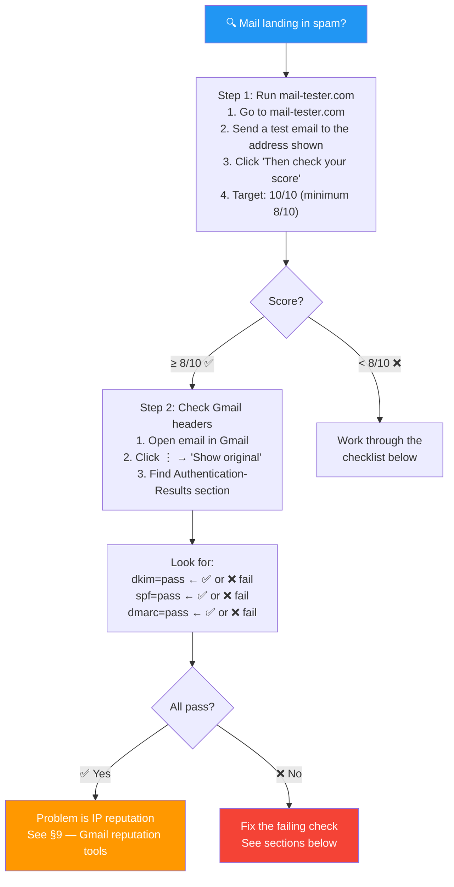
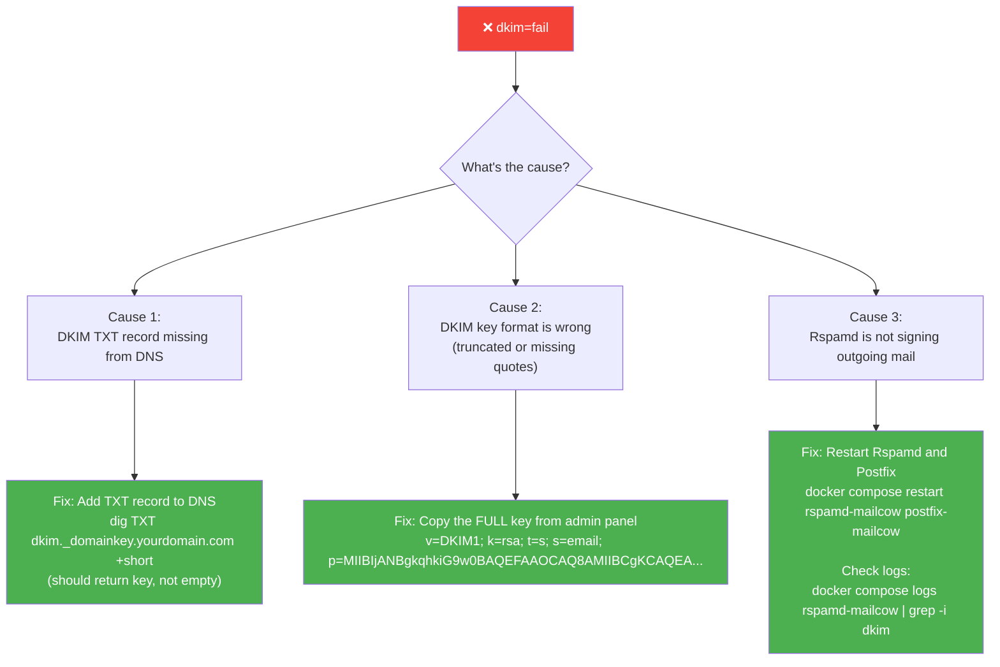
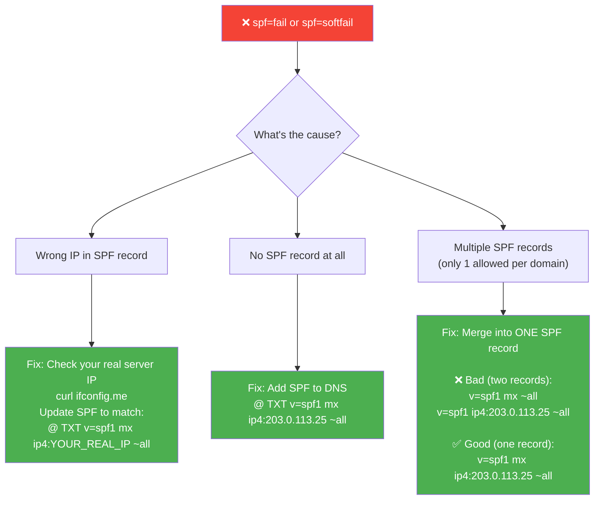
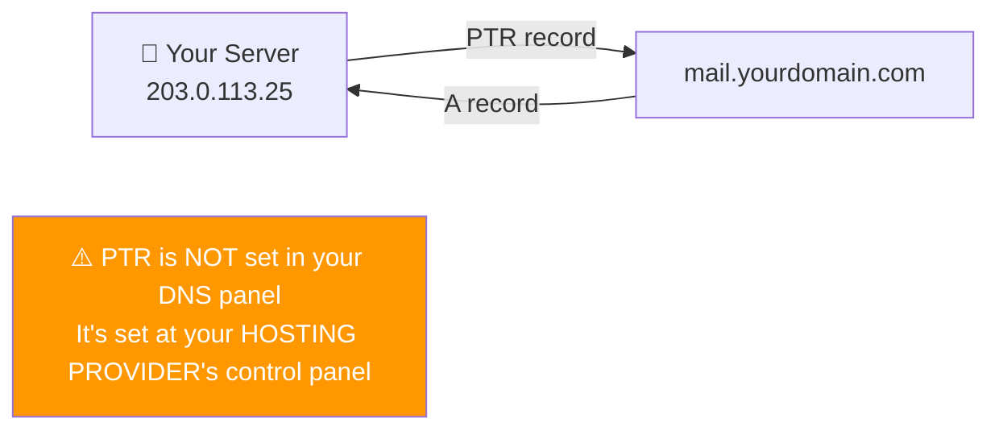
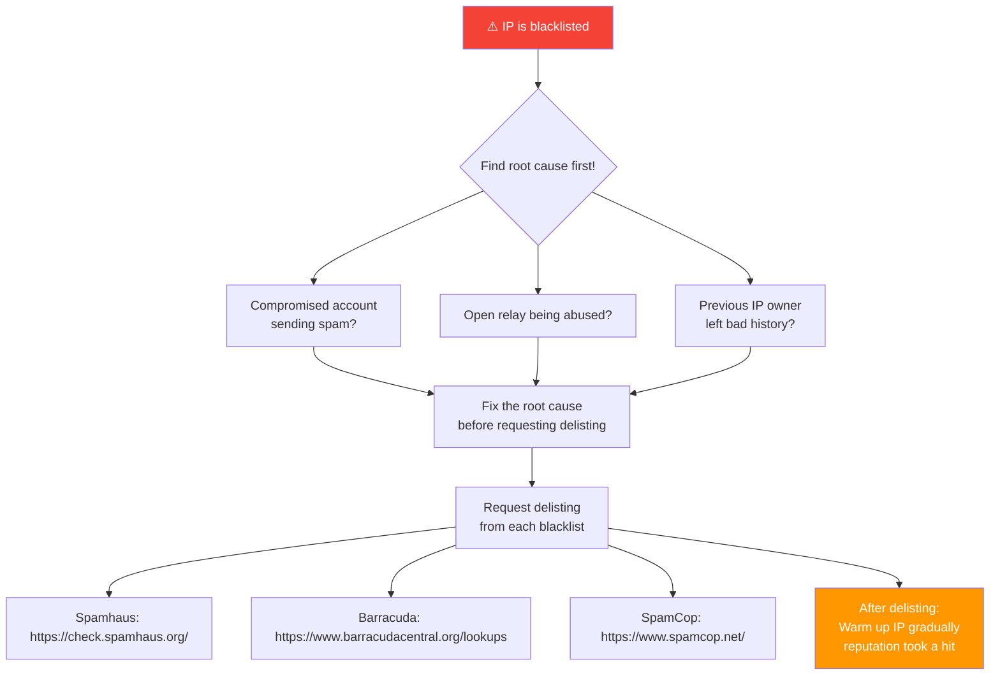
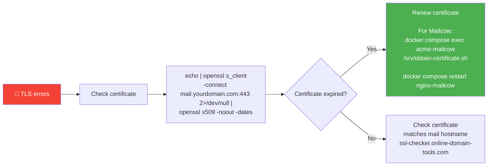
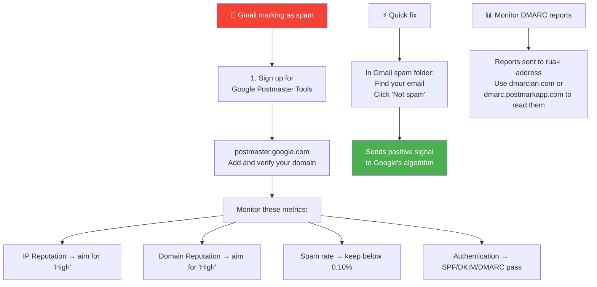
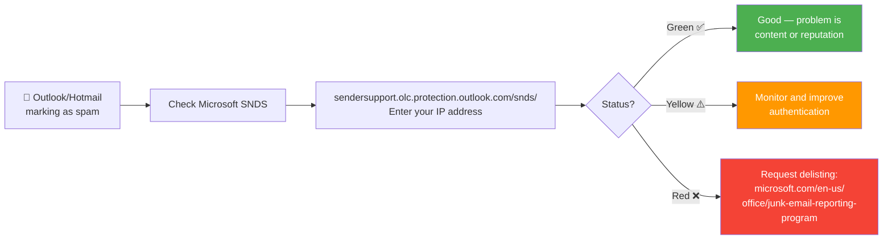

# Spam Troubleshooting — Why Emails Land in Spam

> **Problem:** Mail sent through your server is being placed in the spam folder by
> Gmail, Outlook, and other providers.
>
> This guide walks you through diagnosing the problem step-by-step and fixing it.

---

## Table of Contents

1. [Quick Diagnosis (5 Minutes)](#quick-diagnosis-5-minutes)
2. [Full Verification Checklist](#full-verification-checklist)
3. [DKIM Failures](#dkim-failures)
4. [SPF Failures](#spf-failures)
5. [PTR (Reverse DNS) Missing](#ptr-reverse-dns-missing)
6. [IP on a Blacklist](#ip-on-a-blacklist)
7. [Hostname Mismatch](#hostname-mismatch)
8. [TLS Certificate Problems](#tls-certificate-problems)
9. [Escaping Gmail's Spam Folder](#escaping-gmails-spam-folder)
10. [Escaping Outlook's Spam Folder](#escaping-outlooks-spam-folder)
11. [Deliverability Score Card](#deliverability-score-card)
12. [Monitoring Script](#monitoring-script)

---

## Quick Diagnosis (5 Minutes)



---

## Full Verification Checklist

```bash
DOMAIN="yourdomain.com"
IP="203.0.113.25"

echo "--- MX ---"
dig MX $DOMAIN +short

echo "--- A (mail subdomain) ---"
dig A mail.$DOMAIN +short

echo "--- SPF ---"
dig TXT $DOMAIN +short | grep spf

echo "--- DKIM ---"
dig TXT dkim._domainkey.$DOMAIN +short

echo "--- DMARC ---"
dig TXT _dmarc.$DOMAIN +short

echo "--- PTR ---"
dig -x $IP +short
```

**Expected output:**
```
--- MX ---
10 mail.yourdomain.com.

--- A (mail subdomain) ---
203.0.113.25

--- SPF ---
"v=spf1 mx ip4:203.0.113.25 ~all"

--- DKIM ---
"v=DKIM1; k=rsa; t=s; s=email; p=MIIBIjAN..."

--- DMARC ---
"v=DMARC1; p=none; rua=mailto:admin@yourdomain.com"

--- PTR ---
mail.yourdomain.com.
```

### Blacklist Check

```bash
# Check manually against major blacklists
for bl in zen.spamhaus.org bl.spamcop.net b.barracudacentral.org; do
  result=$(dig +short $IP.$bl 2>/dev/null)
  if [ -n "$result" ]; then
    echo "❌ BLACKLISTED: $bl ($result)"
  else
    echo "✅ Clean: $bl"
  fi
done
```

Or online: https://mxtoolbox.com/blacklists.aspx

---

## DKIM Failures



**Diagnosing Rspamd (for Mailcow):**

```bash
# Check Rspamd logs for DKIM activity
docker compose logs rspamd-mailcow | grep -i dkim

# Check Postfix logs for signing
docker compose logs postfix-mailcow | grep -i dkim

# Verify key status in admin panel
# Admin → System → Configuration → Options → ARC/DKIM keys
# Look for green "Key valid" badge next to your domain
```

---

## SPF Failures



---

## PTR (Reverse DNS) Missing



**Check if PTR is set:**

```bash
dig -x 203.0.113.25 +short
# Should return: mail.yourdomain.com.
# If empty or wrong → PTR is not set
```

**How to set PTR (varies by provider):**

| Provider | Where to Set PTR |
|----------|-----------------|
| **Hetzner** | Cloud panel → Server → Networking → Reverse DNS |
| **DigitalOcean** | Droplet → Networking → rDNS |
| **Vultr** | Instances → IPv4 → Reverse DNS |
| **AWS** | Submit support request (requires Elastic IP) |
| **Generic** | Open a support ticket requesting: `203.0.113.25 → mail.yourdomain.com` |

---

## IP on a Blacklist



> **Prevention:** Never be an open relay, rate-limit submissions, use strong authentication,
> and monitor your queue for sudden volume spikes (a hijacked account is the usual cause).

---

## Hostname Mismatch

**Problem:** Server hostname doesn't match the SMTP EHLO name.

```bash
# Check server hostname
hostname -f
# Should be: mail.yourdomain.com

# Check Postfix hostname (for Mailcow)
docker exec postfix-mailcow postconf myhostname
# Should be: mail.yourdomain.com
```

**Fix:**

```bash
# Set server hostname
hostnamectl set-hostname mail.yourdomain.com

# For Mailcow: check mailcow.conf
grep MAILCOW_HOSTNAME /opt/mailcow-dockerized/mailcow.conf
# Should be: MAILCOW_HOSTNAME=mail.yourdomain.com
```

---

## TLS Certificate Problems



```bash
# Check certificate expiry date
echo | openssl s_client -connect mail.yourdomain.com:443 2>/dev/null | \
  openssl x509 -noout -dates

# Check ACME logs (Mailcow)
docker compose logs acme-mailcow | tail -30

# Force certificate renewal (Mailcow)
cd /opt/mailcow-dockerized
docker compose exec acme-mailcow /srv/obtain-certificate.sh
docker compose restart nginx-mailcow
```

---

## Escaping Gmail's Spam Folder



### Google Postmaster Tools Setup

1. Go to https://postmaster.google.com
2. Sign in with a Google account
3. Click **"+ Domain"** → enter `yourdomain.com`
4. Verify domain ownership (via DNS TXT record)
5. Monitor **IP Reputation** and **Domain Reputation** dashboards

**Target:** `Good` or `High` reputation

---

## Escaping Outlook's Spam Folder



---

## Deliverability Score Card

Use this table to track your configuration status:

| Check | Result | Status |
|---|---|---|
| **DKIM** | pass / fail | ☐ |
| **SPF** | pass / fail | ☐ |
| **DMARC** | pass / fail | ☐ |
| **PTR (reverse DNS)** | set / missing | ☐ |
| **Blacklists** | clean / listed | ☐ |
| **TLS grade** | A+ / B / C | ☐ |
| **mail-tester score** | x / 10 | ☐ |
| **PTR ↔ HELO match** | match / no | ☐ |

*All checks ✅ = mail should reliably reach the inbox*

---

## Monitoring Script

Save this script on your server and run it daily via cron:

```bash
#!/bin/bash
# /opt/mailcheck.sh
# Run daily: crontab -e
# 0 9 * * * /opt/mailcheck.sh | mail -s "Mail Server Status" admin@yourdomain.com

DOMAIN="yourdomain.com"
IP="203.0.113.25"

echo "=============================="
echo "Mail Server Status: $(date)"
echo "=============================="

# MX check
MX=$(dig MX $DOMAIN +short)
echo "MX: $MX"

# SPF check
SPF=$(dig TXT $DOMAIN +short | grep spf)
echo "SPF: $SPF"

# DKIM check
DKIM=$(dig TXT dkim._domainkey.$DOMAIN +short | head -c 50)
echo "DKIM: $DKIM..."

# PTR check
PTR=$(dig -x $IP +short)
echo "PTR: $PTR"

# Disk usage
DISK=$(df -h /opt/mailcow-dockerized 2>/dev/null || df -h /var/mail | tail -1 | awk '{print $5}')
echo "Disk: $DISK used"

# Check if any containers are stopped (Mailcow)
if command -v docker &>/dev/null; then
  STOPPED=$(docker compose -f /opt/mailcow-dockerized/docker-compose.yml ps --filter "status=exited" -q 2>/dev/null | wc -l)
  echo "Stopped containers: $STOPPED"
fi

# Blacklist check
echo "--- Blacklist Status ---"
for bl in zen.spamhaus.org bl.spamcop.net b.barracudacentral.org; do
  result=$(dig +short $(echo $IP | awk -F. '{print $4"."$3"."$2"."$1}').$bl 2>/dev/null)
  if [ -n "$result" ]; then
    echo "❌ BLACKLISTED: $bl"
  else
    echo "✅ Clean: $bl"
  fi
done

echo "=============================="
```

```bash
chmod +x /opt/mailcheck.sh
```

---

### See Also

- [← Mailcow Complete Guide](../mailcow/MAILCOW_GUIDE.md)
- [← DNS Quick Reference](DNS_REFERENCE.md)
- [Troubleshooting & Operations](TROUBLESHOOTING.md)

[← Back to index](../../README.md)
