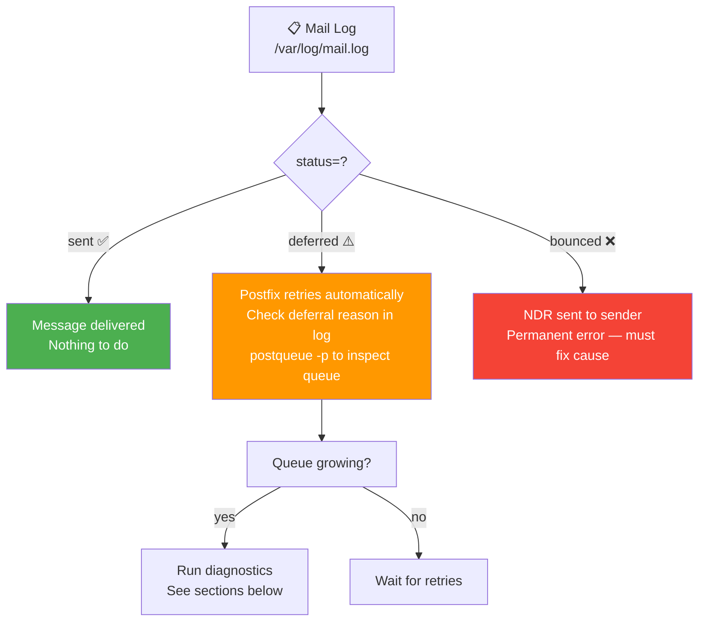
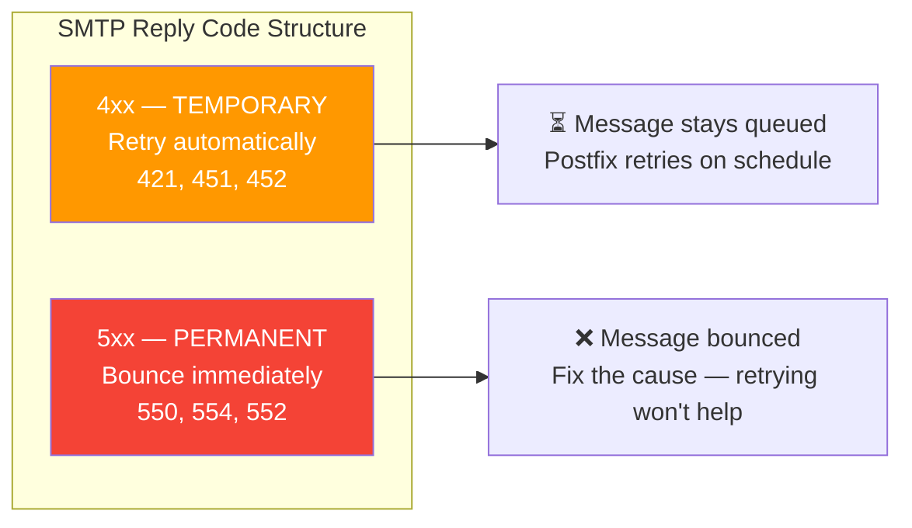
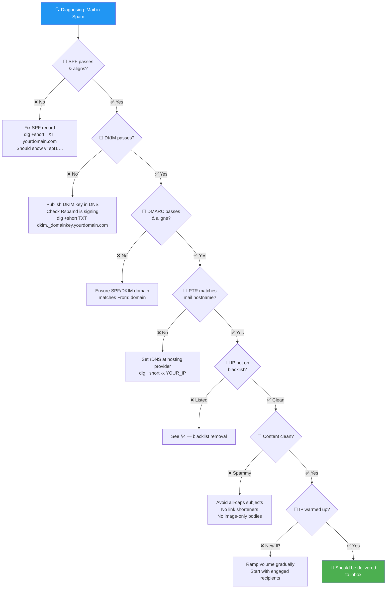
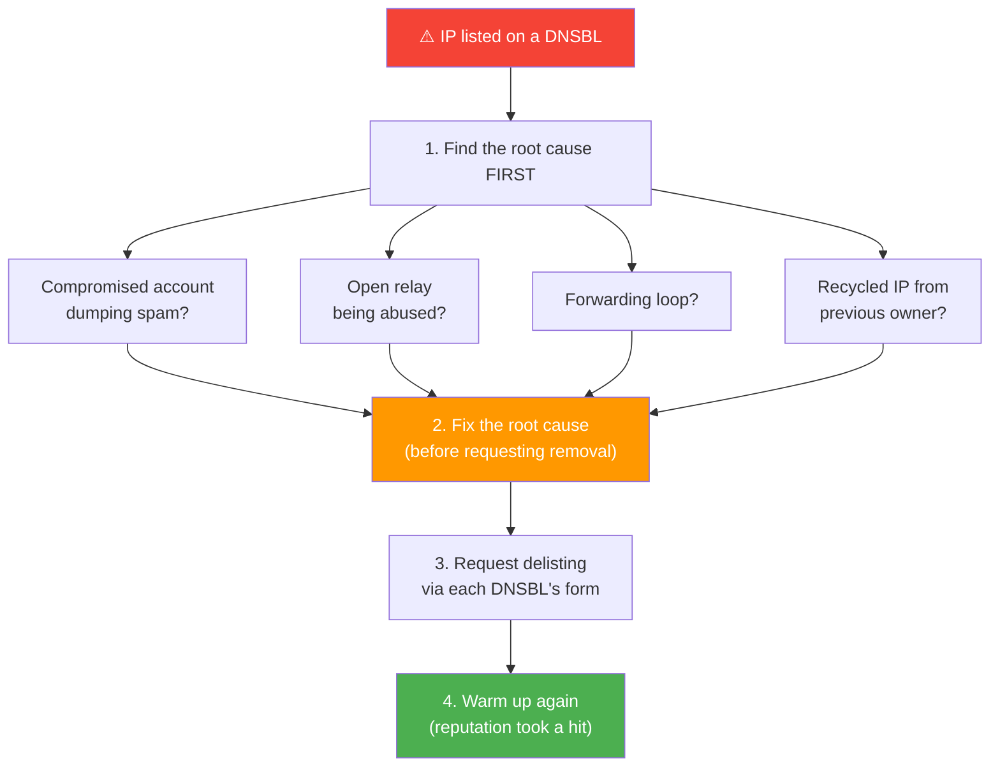
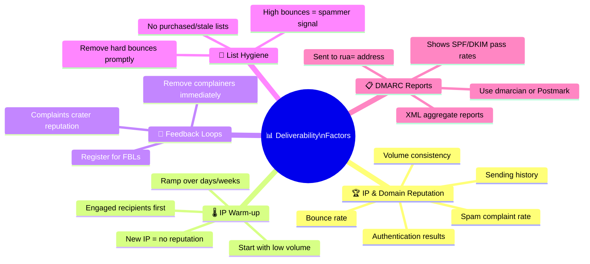
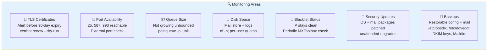
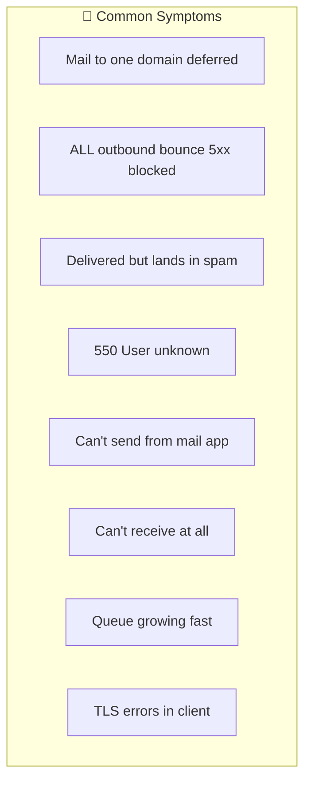

# Troubleshooting & Operations

Running a mail server is mostly about diagnosing *why a message didn't arrive* and
keeping your *sending reputation* healthy. This guide covers reading logs, decoding
bounces, escaping the spam folder, getting off blacklists, and the routine maintenance
that keeps it all working.

---

## Table of Contents

1. [Reading the Logs and the Queue](#reading-the-logs-and-the-queue)
2. [Decoding Bounces and Status Codes](#decoding-bounces-and-status-codes)
3. ["My Mail Lands in Spam" Checklist](#my-mail-lands-in-spam-checklist)
4. [Blacklists (DNSBLs)](#blacklists-dnsbls)
5. [Deliverability Deep-Dive](#deliverability-deep-dive)
6. [Monitoring & Maintenance](#monitoring--maintenance)
7. [Quick Reference: Symptom → Cause → Fix](#quick-reference-symptom--cause--fix)

---

## Reading the Logs and the Queue

The mail log is the **first place to look for everything**. On Debian/Ubuntu:

```bash
sudo tail -f /var/log/mail.log               # follow live
sudo journalctl -u postfix -f                # same, via journald
grep "status=bounced" /var/log/mail.log      # find rejected deliveries
```

### Log Status Values

| Log fragment | Meaning |
|---|---|
| status=sent | ✅ Delivered (or relayed) successfully |
| status=deferred | ⚠️ Temporary failure; Postfix will retry |
| status=bounced | ❌ Permanent failure; an NDR is generated |

### Queue Management

```bash
postqueue -p           # list queued messages (or: mailq)
postqueue -f           # flush: try delivering everything now
postcat -q <QUEUE_ID>  # view a specific queued message
postsuper -d <QUEUE_ID># delete one message
postsuper -d ALL       # delete ALL queued messages (caution!)
```



---

## Decoding Bounces and Status Codes

A **bounce** (NDR — Non-Delivery Report) is an automated message telling the *envelope*
sender that delivery failed.

```
550 5.1.1 <nobody@example.org>: Recipient address rejected: User unknown
└┬┘ └─┬─┘ └───────────────────── human-readable reason ──────────────────┘
 │    └ enhanced status code (class.subject.detail)
 └ classic 3-digit reply code
```



### Common Permanent Codes

| Code | Meaning | Action |
|------|---------|--------|
| `550 User unknown` | Recipient address doesn't exist | Fix the address; remove from list |
| `550 5.7.1 blocked` / `554` | IP or domain is blocked (reputation/blacklist) | Check DNSBLs (see §4) |
| `550 5.7.26 SPF/DKIM/DMARC` | Authentication failed | Fix your DNS records (see §3) |

---

## "My Mail Lands in Spam" Checklist

The #1 self-hosting complaint. Work through these **in order**:



**Fastest diagnostic:**
1. Send a message to **mail-tester.com** (gives a 0–10 score with specifics)
2. Open a Gmail copy → **"Show original"** → read the actual `Authentication-Results`

---

## Blacklists (DNSBLs)

A **DNSBL** (DNS-based blacklist) is a published list of IPs known for spam.
If your server's IP is listed, many receivers reject your mail outright.



**Check your IP:**

```bash
# Is 203.0.113.25 on Spamhaus zen? An A-record answer means "listed".
dig +short 25.113.0.203.zen.spamhaus.org
```

Online tools:
- **MXToolbox Blacklist Check** — https://mxtoolbox.com/blacklists.aspx
- **Spamhaus lookup** — https://check.spamhaus.org/

> **Prevention beats cure.** Don't be an open relay, rate-limit submissions,
> secure accounts with strong auth, and monitor your queue for sudden spikes.

---

## Deliverability Deep-Dive

Even with perfect config, *reputation* decides whether you reach the inbox:



### DMARC Tightening Timeline

```
Week 1:   p=none       ←  Monitor only, no effect on delivery
              ↓
              Read aggregate reports at rua= address
              ↓
Week 2+:  p=quarantine ←  Suspicious mail → spam folder
              ↓
              Continue monitoring, fix any misses
              ↓
Month 2+: p=reject     ←  Failed mail rejected outright
```

---

## Monitoring & Maintenance

Mail is a service that **breaks quietly**. Keep an eye on:



| Area | What to Watch | How |
|------|--------------|-----|
| **Certificates** | TLS cert not expired | `certbot renew --dry-run`; alert before expiry |
| **Ports** | 25/587/993 reachable | External port check / uptime monitor |
| **Queue** | Not growing unbounded | `postqueue -p \| tail`; alert on size |
| **Disk** | Mail store + logs not full | `df -h`; per-user quotas in Dovecot |
| **Blacklists** | IP stays clean | Periodic MXToolbox/Spamhaus check |
| **Security** | OS + mail packages patched | `unattended-upgrades`; subscribe to advisories |
| **Backups** | Restorable config + mail | Back up `/etc/postfix`, `/etc/dovecot`, DKIM keys, Maildirs |

---

## Quick Reference: Symptom → Cause → Fix



| Symptom | Likely Cause | Fix |
|---------|-------------|-----|
| Mail to one domain `deferred` | Greylisting / their rate limit | Wait; Postfix retries. Persistent → check their bounce text |
| **All** outbound bounce `5xx … blocked` | IP blacklisted | Check DNSBLs (§4); find root cause; request delisting |
| Mail delivered but lands in **spam** | SPF/DKIM/DMARC fail or unaligned; cold IP | Run the §3 checklist + mail-tester |
| `550 User unknown` on outbound | Recipient address wrong/dead | Fix the address; remove from list |
| Can't send from mail app | Submission/auth misconfigured | Use port 587/465 with auth; check `smtpd` logs |
| Can't receive at all | MX/PTR wrong, or port 25 blocked | Verify `dig MX`, PTR; confirm port 25 open inbound |
| Queue growing fast | Account hijacked / loop / downstream down | Inspect `postqueue -p`; lock the account; investigate |
| TLS errors in client | Expired/mismatched cert | `certbot renew`; reload Postfix + Dovecot |

---

### See Also

- [← Self-Hosting Guide](SELF_HOSTING.md) · [Protocols by Hand](PROTOCOLS.md) · [Email Anatomy](EMAIL_ANATOMY.md)
- **Next:** [Choosing Mail Server Software →](CHOOSING_SOFTWARE.md)

[← Back to index](../../README.md)
