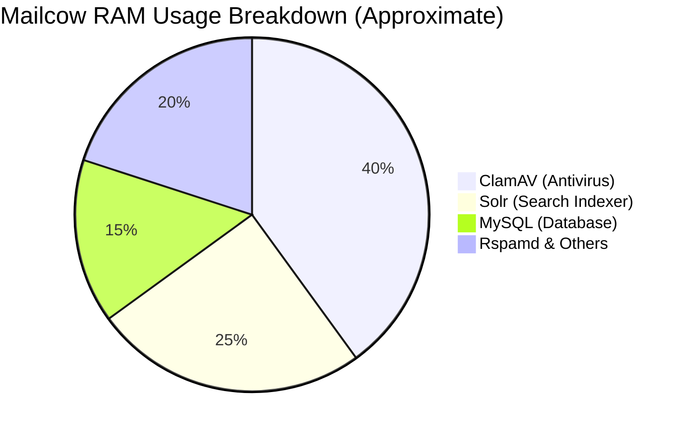
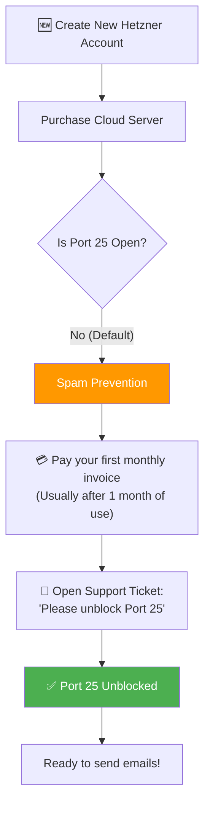

# Why Hetzner is Officially Recommended for Mailcow

> **Context:** If you visit the official [Mailcow VPS recommendations page](https://mailcow.email/vps/), you will see **Hetzner Online GmbH** heavily featured and recommended. 
> 
> This document explains *why* Hetzner is the industry favorite for hosting Mailcow, and details the pros, cons, and configuration steps specific to their platform.

---

## Table of Contents

1. [The "Heavy Lifting" Problem of Mailcow](#the-heavy-lifting-problem-of-mailcow)
2. [Why Hetzner? Key Benefits](#why-hetzner-key-benefits)
3. [The Port 25 Policy (Crucial for New Accounts)](#the-port-25-policy-crucial-for-new-accounts)
4. [Setting Up PTR (Reverse DNS) on Hetzner](#setting-up-ptr-reverse-dns-on-hetzner)
5. [Recommended Server Tiers](#recommended-server-tiers)

---

## The "Heavy Lifting" Problem of Mailcow

Mailcow is an incredibly powerful all-in-one suite. However, because it bundles enterprise-grade tools, it is **very resource-heavy**.

* **Minimum RAM:** 4 GB (Will struggle without disabling ClamAV and Solr).
* **Recommended RAM:** 6 GB to 8 GB.

At standard cloud providers (like AWS, Google Cloud, or DigitalOcean), an 8 GB RAM virtual machine costs between **$40 to $60 per month**. For a personal or small-business mail server, this is often too expensive.

---

## Why Hetzner? Key Benefits

Hetzner solves the "Heavy Lifting" problem while providing excellent mail infrastructure.

| Feature | What Hetzner Offers | Why it Matters for Mailcow |
|---------|---------------------|----------------------------|
| **Price-to-Performance** | ~€7 to €10/month for 8GB RAM (e.g., CPX31) | Mailcow can run with all features (ClamAV, Solr) enabled without breaking the bank. |
| **Simple PTR / rDNS** | 1-Click editable text field in the Cloud Console | PTR is mandatory for email delivery. Many providers make this difficult; Hetzner makes it instant. |
| **Data Privacy (GDPR)** | Servers located in Germany/Finland | Email contains highly sensitive personal data. EU data privacy laws provide maximum legal protection. |
| **Strict Anti-Abuse** | Aggressive suspension of spammers | Hetzner's IP ranges maintain a relatively clean reputation globally, meaning your emails are less likely to bounce. |
| **Generous Bandwidth** | 20 TB included per month | You will never worry about overage charges for attachments or syncing large IMAP folders. |

---

## The Port 25 Policy (Crucial for New Accounts)

To protect their IP reputation from spammers, **Hetzner blocks outbound Port 25 for all brand new accounts.**

### How to Bypass the 1-Month Wait?
If you are a legitimate business and need Port 25 opened immediately:
1. Pre-pay some funds into your account via PayPal or wire transfer.
2. Open a support ticket explaining you are setting up a corporate Mailcow server and provide your company details.
3. Support will usually manually verify you and unblock the port early.

*(Note: For inbound email, Port 25 is always open. Only outbound sending is blocked initially).*

---

## Setting Up PTR (Reverse DNS) on Hetzner

Hetzner provides one of the simplest PTR configurations in the industry.

1. Log into the **Hetzner Cloud Console**.
2. Select your Server.
3. Click on the **Networking** tab.
4. Scroll down to the **Reverse DNS** section.
5. Next to your IPv4 (and IPv6) address, click the pencil icon.
6. Type your mail server's exact hostname (e.g., `mail.yourdomain.com`).
7. Click Save.

That's it. It usually propagates across the globe within minutes.

---

## Recommended Server Tiers

If you are buying a server on Hetzner specifically for Mailcow, here are the recommended tiers:

| Plan | CPU Cores | RAM | Storage | Good For... |
|------|-----------|-----|---------|-------------|
| **CX22** | 2 (Intel) | 4 GB | 40 GB NVMe | **Budget:** Requires disabling ClamAV and Solr inside `mailcow.conf`. |
| **CPX21** | 3 (AMD) | 4 GB | 80 GB NVMe | **Entry:** Better CPU for spam filtering, but still low on RAM. |
| **CPX31** | 4 (AMD) | 8 GB | 160 GB NVMe | **⭐ The Sweet Spot:** Runs all Mailcow features flawlessly with plenty of storage for mailboxes. |
| **CAX21** | 4 (ARM) | 8 GB | 80 GB NVMe | **Warning:** Mailcow has experimental ARM64 support, but x86_64 (AMD/Intel) is highly recommended for stability. |

> **Conclusion:** Hetzner is recommended by the Mailcow team because it represents the absolute best balance of **Hardware Power, Low Cost, and Email-Friendly Infrastructure (PTR/IP Health)**.

---

### See Also

- [← Mailcow Complete Guide](MAILCOW_GUIDE.md)
- [← Cloud Providers & Infrastructure](../general/CLOUD_PROVIDERS.md)

[← Back to index](../../README.md)
