# Mailcow: Dockerized — Complete Guide

> **Mailcow** is an open-source, Docker-based self-hosted email server solution.
> It bundles Postfix, Dovecot, Rspamd, SOGo, Nginx, and more into a single
> Docker Compose package.
>
> - Official site: https://mailcow.email/
> - Official docs: https://docs.mailcow.email/
> - GitHub: https://github.com/mailcow/mailcow-dockerized

---

## Table of Contents

1. [What is Mailcow?](#what-is-mailcow)
2. [Architecture & Components](#architecture--components)
3. [Prerequisites](#prerequisites)
4. [DNS Setup](#dns-setup)
5. [Installation](#installation)
6. [Admin Panel — First Login](#admin-panel--first-login)
7. [Adding Domains & Mailboxes](#adding-domains--mailboxes)
8. [DKIM Setup](#dkim-setup)
9. [SPF, DMARC & PTR](#spf-dmarc--ptr)
10. [TLS Certificates (Let's Encrypt)](#tls-certificates-lets-encrypt)
11. [Updates](#updates)
12. [Backup & Restore](#backup--restore)
13. [Spam & Deliverability](#spam--deliverability)
14. [Rspamd — Spam Filter](#rspamd--spam-filter)
15. [Two-Factor Authentication (2FA)](#two-factor-authentication-2fa)
16. [Troubleshooting](#troubleshooting)
17. [Useful Commands (Cheat Sheet)](#useful-commands-cheat-sheet)
18. [Security Best Practices](#security-best-practices)
19. [Glossary](#glossary)

---

## What is Mailcow?

**Mailcow: Dockerized** is a Docker-based email server suite that lets you run a
complete email infrastructure on your own server.

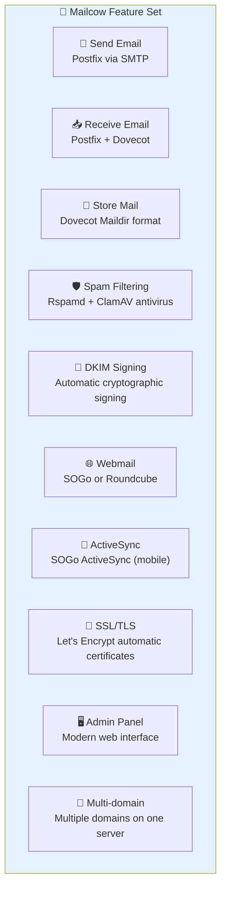

### Mailcow vs Other Solutions

|   | Mailcow | Mailu | iRedMail | Manual Setup |
|---|---|---|---|---|
| Setup ease | ⭐⭐⭐⭐⭐ | ⭐⭐⭐⭐ | ⭐⭐⭐ | ⭐ |
| Admin panel | ✅ Polished | ✅ Basic | ✅ Medium | ❌ None |
| Docker-based | ✅ | ✅ | ❌ | ❌ |
| Webmail | SOGo/RC | RC | RC | Separate |
| Active community | ✅ Large | ✅ | ⭐⭐⭐ | — |

---

## Architecture & Components

Mailcow consists of multiple Docker containers, each with a specific role:

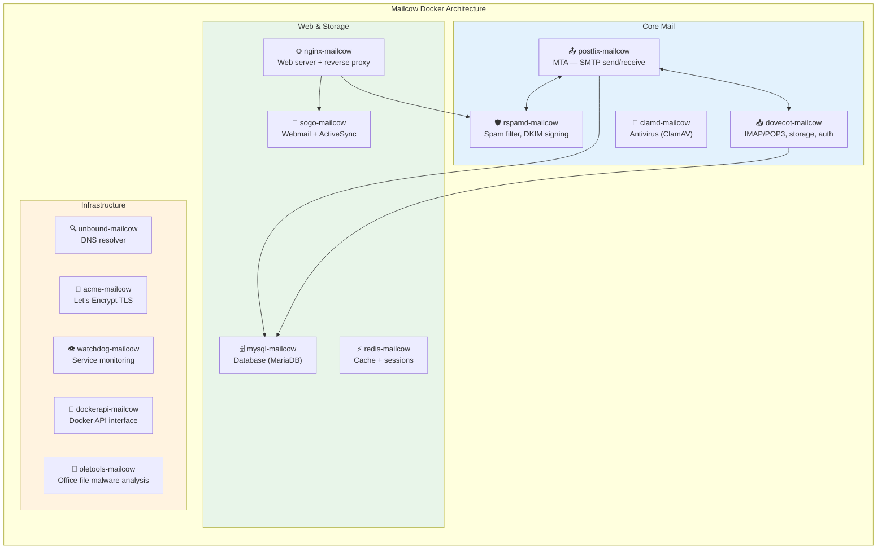

### Port Reference

| Port | Protocol | Purpose |
|---|---|---|
| 25 | SMTP | Server-to-server mail receiving |
| 465 | SMTPS | Mail submission (SSL/TLS) |
| 587 | Submission | Mail submission (STARTTLS) |
| 143 | IMAP | Mail reading (STARTTLS) |
| 993 | IMAPS | Mail reading (SSL/TLS) |
| 110 | POP3 | Mail download |
| 995 | POP3S | Mail download (SSL/TLS) |
| 80 | HTTP | Let's Encrypt + HTTPS redirect |
| 443 | HTTPS | Admin panel, Webmail, ActiveSync |
| 4190 | Sieve | Server-side mail filtering |

---

## Prerequisites

### Minimum Server Requirements

| Resource | Minimum | Recommended |
|---|---|---|
| CPU | 1 core | 2+ cores |
| RAM | 4 GB | 6–8 GB |
| Disk | 20 GB | 50+ GB (for mail) |
| OS | Ubuntu 22.04 | Ubuntu 22.04/24.04 |
| Internet | Static IP | Static IP (required) |

> **Important:** A **static IP address is mandatory**. Dynamic/residential IPs are
> widely blocked for mail delivery.

### Required Software

```bash
# Docker Engine (official method)
curl -fsSL https://get.docker.com | bash

# Verify versions
docker --version
docker compose version   # must be v2.0+

# Git
git --version
```

### Check for Blocked Ports

```bash
# Check if port 25 is open (many hosting providers block it by default)
nc -zv gmail-smtp-in.l.google.com 25

# Check all required ports
for port in 25 80 443 465 587 993 995; do
  nc -zv localhost $port 2>&1 | grep -E "open|refused"
done
```

### Firewall Setup (UFW)

```bash
ufw allow 25/tcp
ufw allow 80/tcp
ufw allow 110/tcp
ufw allow 143/tcp
ufw allow 443/tcp
ufw allow 465/tcp
ufw allow 587/tcp
ufw allow 993/tcp
ufw allow 995/tcp
ufw allow 4190/tcp
ufw allow 22/tcp    # SSH
ufw enable
```

---

## DNS Setup

Set up DNS records **before** installing Mailcow. DNS changes can take 1–48 hours to propagate.

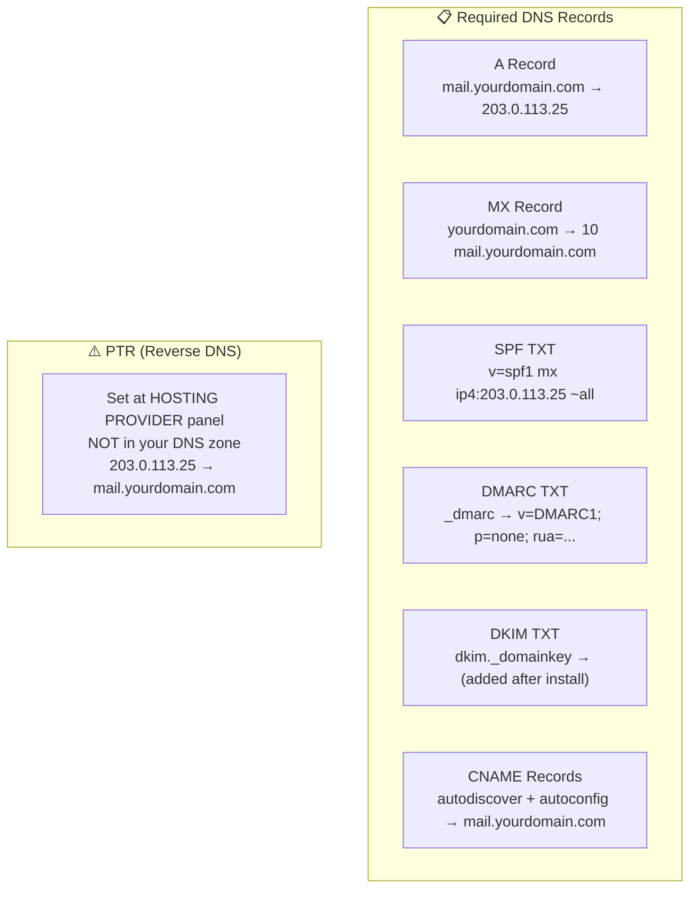

```dns
; ============================================
; A record — mail server IP
; ============================================
mail.yourdomain.com.    IN  A    203.0.113.25

; ============================================
; MX record — who receives mail
; ============================================
yourdomain.com.         IN  MX   10  mail.yourdomain.com.

; ============================================
; SPF — who can send mail
; ============================================
yourdomain.com.         IN  TXT  "v=spf1 mx ip4:203.0.113.25 ~all"

; ============================================
; DMARC — auth policy (monitor mode to start)
; ============================================
_dmarc.yourdomain.com.  IN  TXT  "v=DMARC1; p=none; rua=mailto:admin@yourdomain.com"

; ============================================
; Autodiscover — for email client auto-config
; ============================================
autodiscover.yourdomain.com.  IN  CNAME  mail.yourdomain.com.
autoconfig.yourdomain.com.    IN  CNAME  mail.yourdomain.com.
```

### Verify DNS

```bash
dig MX yourdomain.com +short
dig A mail.yourdomain.com +short
dig TXT yourdomain.com +short | grep spf
dig TXT _dmarc.yourdomain.com +short
dig -x 203.0.113.25 +short   # PTR
```

---

## Installation

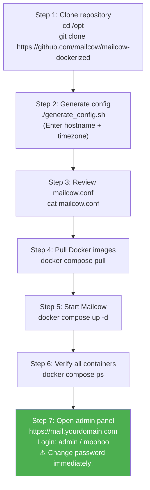

### Step 1: Clone Repository

```bash
cd /opt
git clone https://github.com/mailcow/mailcow-dockerized
cd mailcow-dockerized
```

### Step 2: Generate Config

```bash
./generate_config.sh
```

The script asks for:
- **Mail server hostname** (e.g., `mail.yourdomain.com`)
- **Timezone** (e.g., `America/New_York`)

This creates `mailcow.conf` with key variables:

```ini
MAILCOW_HOSTNAME=mail.yourdomain.com
TZ=America/New_York
HTTP_PORT=80
HTTPS_PORT=443
```

### Steps 3–7

```bash
# Pull images
docker compose pull

# Start all containers
docker compose up -d

# Verify all containers show "Up"
docker compose ps

# Watch logs
docker compose logs -f
```

**All containers should show `Up` status:**

```
NAME                    STATUS
clamd-mailcow           Up
dockerapi-mailcow       Up
dovecot-mailcow         Up
memcached-mailcow       Up
mysql-mailcow           Up (healthy)
netfilter-mailcow       Up
nginx-mailcow           Up
oletools-mailcow        Up
postfix-mailcow         Up
redis-mailcow           Up
rspamd-mailcow          Up
sogo-mailcow            Up
unbound-mailcow         Up
watchdog-mailcow        Up
acme-mailcow            Up
```

---

## Admin Panel — First Login

```
URL:      https://mail.yourdomain.com
Username: admin
Password: moohoo

⚠️ CHANGE THE PASSWORD IMMEDIATELY AFTER FIRST LOGIN
```

### Admin Panel Navigation

```
System
├── Configuration
│   ├── Options        ← DKIM keys, spam settings
│   ├── Routing        ← Transport and routing
│   └── System mails   ← System notifications
├── Edit               ← Admin account settings
└── Watchdog           ← Monitoring status

E-Mail
├── Configuration
│   ├── Domains        ← Domain management
│   ├── Mailboxes      ← Mailbox management
│   ├── Aliases        ← Alias addresses
│   └── Sync Jobs      ← External IMAP sync
├── Filter             ← Spam rules
└── Routing            ← Email routing

Apps
├── SOGo               ← Webmail (SOGo)
├── Rspamd             ← Spam filter dashboard
└── Autodiscover       ← Client auto-config
```

---

## Adding Domains & Mailboxes

### Add a New Domain

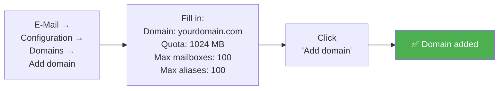

### Add a New Mailbox

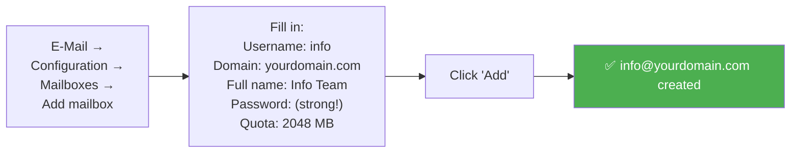

### Add an Alias

```
E-Mail → Configuration → Aliases → Add alias

Alias address:   support@yourdomain.com
Goto addresses:  info@yourdomain.com
```

---

## DKIM Setup

DKIM (DomainKeys Identified Mail) adds a cryptographic signature to your outgoing mail,
preventing it from being marked as spam.

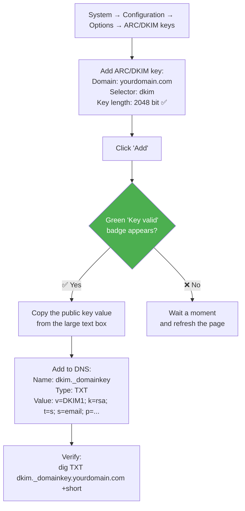

### Verify DKIM

```bash
# Via DNS
dig TXT dkim._domainkey.yourdomain.com +short

# Online
# https://mxtoolbox.com/dkim.aspx
# Domain: yourdomain.com, Selector: dkim

# Full score test
# https://mail-tester.com
# Send a test email to the address shown — aim for 10/10
```

### DKIM Troubleshooting

| Problem | Cause | Fix |
|---------|-------|-----|
| "Key missing" | No TXT record in DNS | Add DKIM TXT record |
| "Key unused" | Postfix not signing | Restart containers |
| "Key invalid" | Wrong value in DNS | Re-copy key from admin panel |
| DKIM fail | Wrong selector | Check `dkim._domainkey` in DNS |

---

## SPF, DMARC & PTR

### SPF (Sender Policy Framework)

```dns
; Simple SPF — only MX server allowed
yourdomain.com.  IN  TXT  "v=spf1 mx ~all"

; With explicit IP
yourdomain.com.  IN  TXT  "v=spf1 mx ip4:203.0.113.25 ~all"
```

**`~all` vs `-all`:**

| Directive | Meaning | When to use |
|---|---|---|
| ~all | SoftFail — may be spam | During initial<br>setup |
| -all | HardFail — reject | When fully<br>configured |
| ?all | Neutral — no opinion | Not recommended |

### DMARC (Domain-based Message Authentication)

DMARC tells receivers what to do when SPF and DKIM fail.

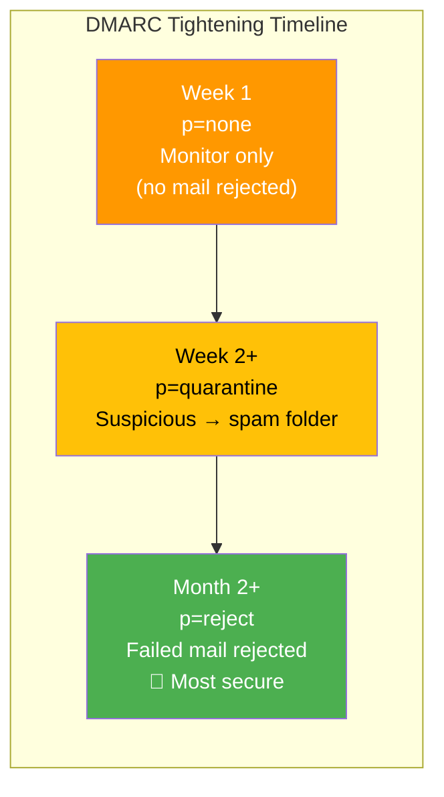

```dns
; Monitor mode (start here)
_dmarc.yourdomain.com.  IN  TXT  "v=DMARC1; p=none; rua=mailto:admin@yourdomain.com"

; Quarantine mode
_dmarc.yourdomain.com.  IN  TXT  "v=DMARC1; p=quarantine; pct=100; rua=mailto:admin@yourdomain.com"

; Reject mode (maximum security)
_dmarc.yourdomain.com.  IN  TXT  "v=DMARC1; p=reject; pct=100; rua=mailto:admin@yourdomain.com"
```

### PTR (Reverse DNS)

```
203.0.113.25  →  mail.yourdomain.com
```

**How to set by provider:**
- **Hetzner:** Cloud panel → Server → Networking → Reverse DNS
- **DigitalOcean:** Droplet → Networking → rDNS
- **Vultr:** Instances → IPv4 → Reverse DNS
- **Generic:** Open a support ticket requesting PTR setup

```bash
# Verify PTR
dig -x 203.0.113.25 +short
# Expected: mail.yourdomain.com.
```

---

## TLS Certificates (Let's Encrypt)

Mailcow automatically obtains and renews Let's Encrypt certificates.

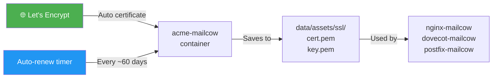

Settings in `mailcow.conf`:

```ini
SKIP_LETS_ENCRYPT=n       # n = use Let's Encrypt (default)
SKIP_HTTP_VERIFICATION=n  # n = standard HTTP challenge
```

```bash
# Check certificate status
docker compose logs acme-mailcow

# Check certificate expiry
echo | openssl s_client -connect mail.yourdomain.com:443 2>/dev/null | \
  openssl x509 -noout -dates

# Force certificate renewal
cd /opt/mailcow-dockerized
docker compose exec acme-mailcow /srv/obtain-certificate.sh
```

### Using a Custom Certificate

```bash
# Copy certificate files
cp fullchain.pem /opt/mailcow-dockerized/data/assets/ssl/cert.pem
cp privkey.pem   /opt/mailcow-dockerized/data/assets/ssl/key.pem

# Restart relevant services
docker compose restart nginx-mailcow dovecot-mailcow postfix-mailcow
```

---

## Updates

```bash
cd /opt/mailcow-dockerized
./update.sh
```

The script automatically:
1. Updates the Git repository
2. Pulls new Docker images
3. Restarts containers
4. Runs database migrations

### Update to Nightly Version

```bash
./update.sh --nightly
```

### Backup Before Updating

```bash
tar -czf mailcow-backup-$(date +%Y%m%d).tar.gz \
  /opt/mailcow-dockerized/mailcow.conf \
  /opt/mailcow-dockerized/data/
```

---

## Backup & Restore

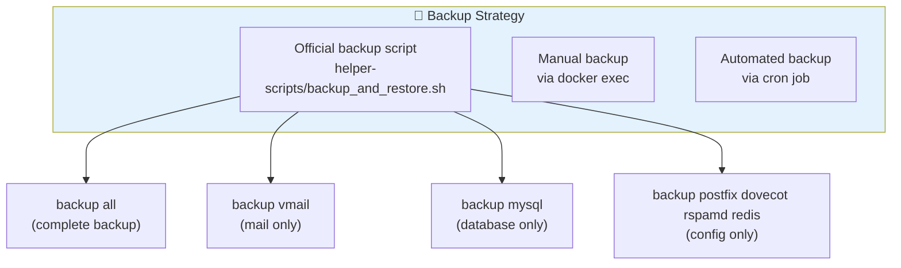

### Using the Official Backup Script

```bash
cd /opt/mailcow-dockerized

# Full backup
./helper-scripts/backup_and_restore.sh backup all

# Mail only
./helper-scripts/backup_and_restore.sh backup vmail

# Database only
./helper-scripts/backup_and_restore.sh backup mysql

# Config only
./helper-scripts/backup_and_restore.sh backup postfix dovecot rspamd redis
```

Backups are saved to: `/var/mailcow-backups/`

### Restore

```bash
# Full restore
./helper-scripts/backup_and_restore.sh restore

# Restore from specific backup
./helper-scripts/backup_and_restore.sh restore /var/mailcow-backups/2026-07-06_backup
```

### Automated Daily Backup

```bash
# Add to crontab -e
0 2 * * * cd /opt/mailcow-dockerized && \
  ./helper-scripts/backup_and_restore.sh backup all > \
  /var/log/mailcow-backup.log 2>&1
```

---

## Spam & Deliverability

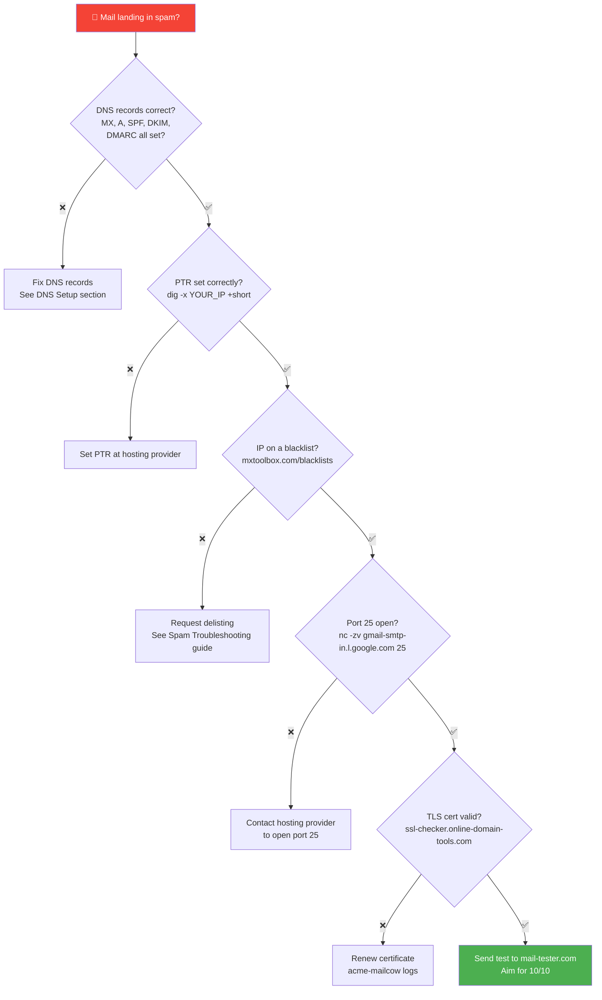

### Deliverability Testing Tools

| Tool | URL | Checks |
|------|-----|--------|
| **Mail Tester** | mail-tester.com | Overall score (0–10) |
| **MXToolbox** | mxtoolbox.com | DNS, blacklist, SMTP |
| **GlockApps** | glockapps.com | Inbox placement test |
| **SSL Labs** | ssllabs.com/ssltest | TLS quality |
| **Google Postmaster** | postmaster.google.com | Gmail reputation |

---

## Rspamd — Spam Filter

Rspamd analyzes mail and assigns a score to determine if it's spam.

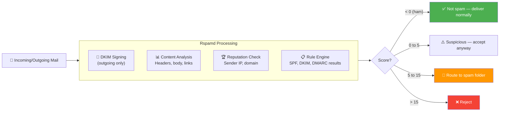

### Rspamd Web Interface

```
Admin panel: Apps → Rspamd
Direct URL:  https://mail.yourdomain.com/rspamd
```

### Score Reference

| Score | Action |
|-------|--------|
| `< 0` | Ham (not spam) — deliver normally |
| `0–5` | Suspicious — accepted |
| `5–15` | Route to spam folder |
| `> 15` | Reject |

### Whitelist / Blacklist

```
Admin panel → E-Mail → Filter → Global filter maps
```

```bash
# Manual whitelist entry
echo "trusted.sender@example.com" >> \
  /opt/mailcow-dockerized/data/conf/rspamd/local.d/custom_whitelist.map
```

---

## Two-Factor Authentication (2FA)

Mailcow supports 2FA for admin and user accounts.

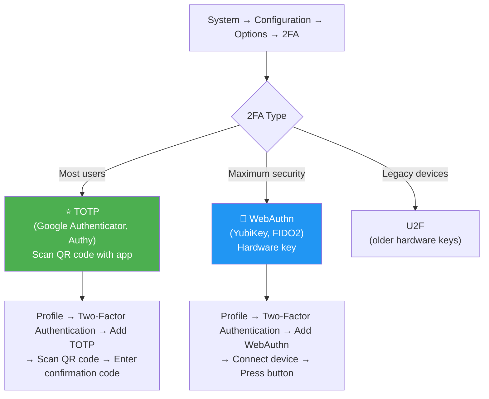

---

## Troubleshooting

### Container Not Running

```bash
# Check all container statuses
docker compose ps

# View problematic container logs
docker compose logs <container-name>

# Restart a container
docker compose restart <container-name>

# Restart all containers
docker compose down && docker compose up -d
```

### Cannot Send Mail

```bash
# Postfix logs
docker compose logs postfix-mailcow | tail -100

# View the queue
docker exec postfix-mailcow mailq

# Flush the queue (retry delivery)
docker exec postfix-mailcow postqueue -f

# Clear the entire queue
docker exec postfix-mailcow postsuper -d ALL
```

### Cannot Receive Mail

```bash
# Dovecot logs
docker compose logs dovecot-mailcow | tail -100

# Test IMAP connection
openssl s_client -connect mail.yourdomain.com:993

# Check mail storage
ls -la /opt/mailcow-dockerized/data/vmail/
```

### TLS Certificate Not Renewing

```bash
# ACME container logs
docker compose logs acme-mailcow

# Force renewal
docker compose exec acme-mailcow /srv/obtain-certificate.sh

# Check DNS propagation
dig A mail.yourdomain.com @8.8.8.8
```

### Common Errors

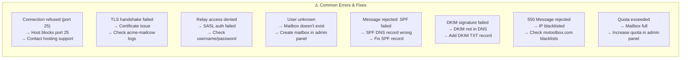

| Error | Cause | Fix |
|-------|-------|-----|
| `Connection refused (port 25)` | Port blocked by host | Contact hosting provider to open port 25 |
| `TLS handshake failed` | Certificate issue | Check `acme-mailcow` logs |
| `Relay access denied` | SASL auth failed | Check username/password |
| `User unknown` | Mailbox doesn't exist | Create mailbox in admin panel |
| `Message rejected: SPF failed` | SPF DNS record wrong | Fix SPF record in DNS |
| `DKIM signature failed` | DKIM not in DNS | Add DKIM TXT record |
| `550 Message rejected` | IP blacklisted | Check mxtoolbox.com blacklists |
| `Quota exceeded` | Mailbox full | Increase quota in admin panel |

---

## Useful Commands (Cheat Sheet)

### Core Management

```bash
# Navigate to Mailcow directory
cd /opt/mailcow-dockerized

# Start all containers
docker compose up -d

# Stop all containers
docker compose down

# Restart all containers
docker compose restart

# Restart one container
docker compose restart postfix-mailcow

# View logs (last 100 lines)
docker compose logs --tail=100 postfix-mailcow

# Real-time logs
docker compose logs -f

# Container status
docker compose ps

# Update Mailcow
./update.sh
```

### Mail Queue Management

```bash
# View queue
docker exec postfix-mailcow mailq

# Flush queue (retry now)
docker exec postfix-mailcow postqueue -f

# Delete all queued messages
docker exec postfix-mailcow postsuper -d ALL

# Delete one message by ID
docker exec postfix-mailcow postsuper -d <MESSAGE_ID>

# Check Postfix config
docker exec postfix-mailcow postconf | grep -i relay

# SMTP test
docker exec postfix-mailcow sendmail -bv test@gmail.com
```

### Dovecot Management

```bash
# List active connections
docker exec dovecot-mailcow doveadm who

# All user quota stats
docker exec dovecot-mailcow doveadm quota get -A

# One user quota
docker exec dovecot-mailcow doveadm quota get -u user@yourdomain.com

# Generate password hash
docker exec dovecot-mailcow doveadm pw -s SHA512-CRYPT

# Rebuild index for user
docker exec dovecot-mailcow doveadm index -u user@yourdomain.com INBOX
```

### Rspamd Management

```bash
# Ping Rspamd
docker exec rspamd-mailcow rspamadm -e ping

# Rspamd statistics
docker exec rspamd-mailcow rspamadm stat

# Test an email through Rspamd
docker exec rspamd-mailcow rspamc -h localhost:11333 < /path/to/email.eml

# Rspamd logs
docker compose logs rspamd-mailcow
```

---

## Security Best Practices

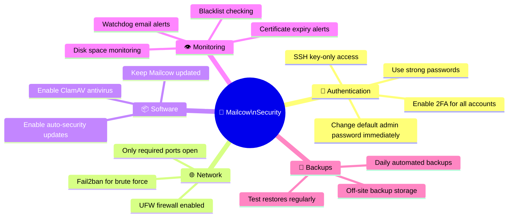

### Core Security Steps

```bash
# 1. Change default password (via admin panel UI)
# Admin panel → admin → Edit → new password

# 2. SSH key-only access
echo "PasswordAuthentication no" >> /etc/ssh/sshd_config
systemctl restart sshd

# 3. Enable UFW firewall
ufw enable
ufw default deny incoming
ufw default allow outgoing
# (add email ports as shown in Prerequisites section)

# 4. Enable ClamAV (in mailcow.conf)
SKIP_CLAMD=n
SKIP_FRESHCLAM=n

# 5. Monitor disk usage
df -h /opt/mailcow-dockerized/

# 6. Monitor container resources
docker stats
```

---

## Glossary

| Term | Full Name | Description |
|------|-----------|-------------|
| **SMTP** | Simple Mail Transfer Protocol | Mail sending protocol |
| **IMAP** | Internet Message Access Protocol | Mail reading (server-stored) |
| **POP3** | Post Office Protocol v3 | Mail download to one device |
| **MTA** | Mail Transfer Agent | Mail routing software (Postfix) |
| **MDA** | Mail Delivery Agent | Places mail in mailbox (Dovecot) |
| **MUA** | Mail User Agent | Email client (Thunderbird, Outlook) |
| **DKIM** | DomainKeys Identified Mail | Cryptographic mail signature |
| **SPF** | Sender Policy Framework | Authorizes sending servers |
| **DMARC** | Domain-based Message Authentication | SPF+DKIM policy enforcement |
| **PTR** | Pointer Record | Reverse DNS (IP → hostname) |
| **MX** | Mail Exchange Record | Which server receives domain mail |
| **TLS** | Transport Layer Security | Encryption protocol |
| **STARTTLS** | — | Upgrade plain connection to TLS |
| **Rspamd** | — | Fast spam filter daemon |
| **ClamAV** | Clam AntiVirus | Open-source antivirus |
| **SOGo** | — | Webmail and GroupWare suite |
| **Postfix** | — | MTA software |
| **Dovecot** | — | IMAP/POP3 server |
| **Let's Encrypt** | — | Free TLS certificate authority |
| **DNSBL** | DNS Blacklist | Public list of spam IPs |
| **Deliverability** | — | Ability of mail to reach inbox |
| **Quota** | — | Storage limit per mailbox |
| **Alias** | — | Redirect address to another mailbox |
| **Relay** | — | Forward mail to another server |

---

## Additional Resources

| Resource | URL |
|----------|-----|
| Official Mailcow Docs | https://docs.mailcow.email/ |
| Mailcow GitHub | https://github.com/mailcow/mailcow-dockerized |
| Mailcow Community (Discourse) | https://community.mailcow.email/ |
| **Why Hetzner for Mailcow?** | [HETZNER_RECOMMENDATION.md](HETZNER_RECOMMENDATION.md) |
| MXToolbox | https://mxtoolbox.com |
| Mail Tester | https://mail-tester.com |
| DKIM Validator | https://mxtoolbox.com/dkim.aspx |
| Google Postmaster Tools | https://postmaster.google.com |
| SSL Labs Test | https://ssllabs.com/ssltest |
| Blacklist Check | https://mxtoolbox.com/blacklists |

---

[← Back to index](../../README.md)
